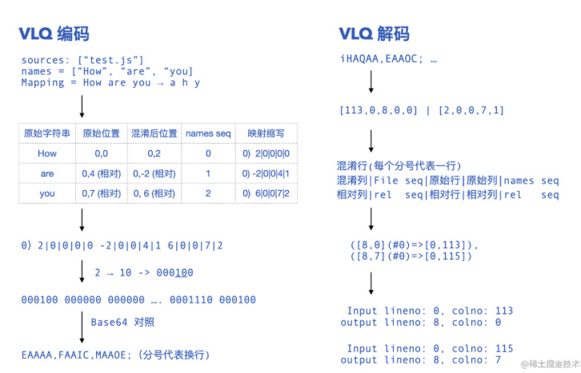

## 如何做好JS异常监控
浏览器全局补货异常
```js
window.addEventListener('error',(err)=>{
    report(err)
})
window.addEventListener('unhandledrejection',(rejection)=>{
    report(rejection)
})

```
### 堆栈反解：sourcemap
sourcemap维护了混淆后的代码行列到原代码行列的映射关系。sourcemap的解析和反解析过程都涉及到VLQ编码（一种见代码映射关系进一步压缩为类base64编码的优化手段）


使用source-map库进行反解即可。
```js
    
```

## 如何做好性能监控

## 如果做好请求/静态资源监控

## SDK如何降低侵入，减少用户性能
