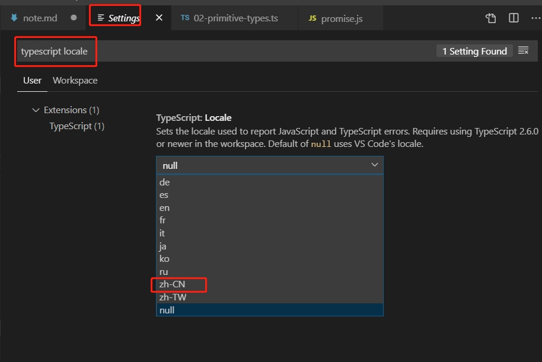

## ES新特性
#### 1、let、const
块级作用域   
变量提升    
最佳实践：不使用var ，默认使用const ，明确会改的使用let。
#### 2、解构
+ 数组  
```
const arr = [1,2,3]
const [a,b] = arr;
const [,,c] = arr;
```
使用...方式解构  
```
const [a,...rest] = arr;
```
默认值   
```
const [a,b,c,d = 12] = arr
```
+ 对象    
```
const obj = {
    name:'zs',
    age:18
}
const {name} = obj;
// 重命名
const {name:rename} = obj;
```

#### 3、模板字符串
```
let str = `
    i am 
    ${name}
`
// 带标签的模板字符串
const str  = console.log`hello world`

```
#### 4、字符串的扩展方法
* includes()
* startsWith()
* endsWith()

#### 5、参数默认值、 剩余参数
... 操作符   
function fn(...args){}

#### 6、展开数组
```
const arr = [1,2,3];
console.log(...arr)
```
#### 7、箭头函数

不会改变this的指向。
箭头函数不适用：
* 构造函数
* 没有arguments
* 没有this

#### 8、对象字面量
```
const obj = {
    foo:123,
    method1(){
        console.log('1')
    },
    //计算属性名
    [Math.random](){

    }
}
```
#### 9、Object
* Object.assign 多个对象复制到一个目标对象。
```
const source1 = {
    a:123,
    b:23
}
const target = {
    a:123,
    c:23
}
const res = Object.assign(target,source1)
```
* Object.is 判断两个值是否一样

#### 10、proxy

Object.defineProperty

proxy 
```
const person = {
    name:'ss',
    age:19
}

const personProxy = new Proxy(person,{
    get(target,key){
        console.log(target,key)
        return 100;
    },
    set(target,key,value){
        console.log(target,key,value)
    }
})
console.log(personProxy.name)
personProxy.sex = '女'

```
proxy的优势：   
+ defineProperty只能监视属性的读写，proxy可以监视delete、方法调用等
```
const person = {
    name:'ss',
    age:19
}
const personProxy = new Proxy(person,{
    deleteProperty(target,property){
        console.log('delete')
    }
})
delete personProxy.age
```

+ proxy更好的监视数组
```
const list = []
const listProxy = new Proxy(list,{
    set(target,property,value){
        console.log(target,property,value)
        target[property] = value;
        return true//表示设置成功
    }
})
listProxy.push(10)
```
#### 11、reflect
统一的对象操作API  
静态类  
内部封装了一系列对对象的底层操作 。  
```
const person = {
    name:'ss',
    age:19
}

const personProxy = new Proxy(person,{
    get(target,key){
        // ... 自定义逻辑
       return Reflect.get(target,key)
    },
    set(target,key,value){
        console.log(target,key,value)
    }
})
console.log(personProxy.name)
personProxy.sex = '女'
```
Reflect.has  
Reflect.deleteProperty  
Reflect.ownkeys   

#### 12、promise
异步编程解决方案

#### 13、class
```
// es5
function Person(name) {
    this.name = name
}
Person.prototype.say = function(){}
// es6
class Person{
    constructor(name){
        this.name = name
    }
    say(){

    }
}
const person = new Person('zhangsan');
```
* 静态方法
```
class Person{
    constructor(name){
        this.name = name
    }
    // 实例方法
    say(){

    }
    // 静态方法
    static create(name){
        return new Person(name)
    }
}
```
* 实例方法
* 类的继承 -- extends

```
class Person{
    constructor(name){
        this.name = name
    }
    say(){
        console.log('父say')
    }   
}
class Student extends Person{
    constructor(name,number){
        super(name)
        this.number = number
    }
    hello(){
        super.say();
        console.log('hello')
    }
}
let stu = new Student('zhaosi',12342);
stu.hello();
```

#### 14、set、map
Set 不允许重复

```
const set = new Set();
set.add(1).add(2).add(3)
// 遍历
set.forEach(()=>{})
for(let i of set){

}
set.size
set.has()
set.delete()
set.clear()

const arr = [1,2,3,1,4,2]
const set1 = new Set(arr)
Array.from(set1)
const arr1 = [...set1]
```

Map
类似对象，
```
const obj = {
}
obj[true] = 'value'
obj[123] = 'value'
obj[{a:1}] = 'value'

Object.keys(obj)

const m = new Map()
const tom = {name:'tom'}
m.set(tom,99)

m.has()
m.delete()
m.clear()

m.forEach(()=>{})

```
#### 15、Symbol
```
const a = Symbol()
console.log(a)

const obj = {
}
obj[Symbol('a')] = 123;
obj[Symbol('b')] = 445;
console.log(obj[Symbol('a')])

const a = Symbol.for('foo')
const b = Symbol.for('foo')
console.log(a===b)

const obj1 = {
    [Symbol.toStringTag]:'XObject'
}
console.log(obj1.toString()) // [object XObject]
```
私有属性  
* 唯一性
* for...in \ Object.key() 获取不到
* Object.getOwnPropertySymbol(obj) 

#### 16、for...of -- 迭代器
```
const arr = [2,324,12,324,2,234]
for(let i of arr){ 
    console.log(i)
    if(i>188){
        break
    }
}
// arr.forEach() //无法中断循环
// arr.some()
// arr.every()

// 遍历set、map

```

可迭代接口 Iterable   
实现Iterable接口，是使用for...of的前提  
```
const arr = [1,23,321,421]
const iterator = arr[Symbol.iterator]() 
iterator.next()
```
实现可迭代接口
```
const obj= {
    store:['foo','bar','baz'],
    [Symbol.iterator]:function(){
        let index = 0;
        const self = this;
        return {
            next:function(){
                const res =  {
                    value:self.store[index],
                    done:index>=self.store.length
                }
                index ++
                return res;
            }
        }
    }
}

for(let item of obj){
    console.log(item)
}
```

*** 迭代器模式 ***
```
const todo = {
    life:['s','d'],
    learn:['e','w2'],
    work:['dfa'],
    each:function(cb){
        const all = [].concat(this.life,this.learn,this.work)
        for(const item of all){
            cb(item)
        }
    },
    [Symbol.iterator]:function(){
        const all = [...this.life,...this.learn,...this.work]
        let index = 0;
        return {
            next:function(){
                return {
                    value:all[index],
                    done:index++>=all.length
                }
            }
        }
    }
}
//for(let item of to.life){}
//for(let item of to.learn){}
//for(let item of to.work){}

todo.each(function(item){
    console.log(item)
})
for(let item of todo){
    console.log(item)
}

```


#### 17、生成器 generator
避免回调嵌套
```
function * foo(){
    console.log('zcc')
    return 100
}
const res = foo();
console.log(res)
res.next() 

// 配合 yield 
function * boo(){
    console.log('111')
    yield 100
    console.log('222')
    yield 200
    console.log('333')
    yield 300
}
const gen = boo();
gen.next()
```
生成器应用   

```
// 案例 ： 发号器
function * createID(){
    let id = 1;
    while(true){
        yield id++
    }
}
const id = createID();
id.next()
// 实现iterator方法
const todo = {
    life:['s','d'],
    learn:['e','w2'],
    work:['dfa'],
    [Symbol.iterator]:function * (){
        const all = [...this.life,...this.learn,...this.work]
        for(let item of all){
            console.log(item)
        }
    }
}
for(let item of todo){
    console.log(item)
}

```


#### 18、ES Modules
模块化

#### 19、ES2016 ES2017
ES2016
* Array.prototype.includes  
* 指数运算符  
     Math.pow()    
     **  2**10  
    
ES2017  
* Object.values()  
* Object.entries() 
* Object.getOwnPropertyDescriptors()
* String.prototype.padStart
* String.prototype.padEnd
* 函数参数中添加尾逗号
```
function foo(arg1,arg2,){

}
```
* async/await 


## TS
解决JS类型系统问题  
+ 强类型 VS 弱类型 （类型安全）  
强类型有更强的类型约束。  
强类型不允许隐式类型转换。  
+ 静态类型 VS 动态类型 （类型检查）
变量声明时就是明确的。-- 静态类型


+  弱类型的问题
    - 运行阶段才能发现错误
    - 类型不明确，造成函数功能发生改变
    - 对对象索引发生错误
```
const obj = {}
obj[123] = 456
obj[123] // undefined
```

+ 强类型的优势
    - 错误更早的暴露
    - 代码更智能，编码更准确
    - 重构更牢靠
    - 减少不必要的类型判断

#### flow（工具）
1、  JS的类型检查器  
通过类型注解的方式，检查类型。
```
function sum(a:number,b:number){
    return a + b
}

```
通过babel去除注解代码。   
2、 使用   
```
yarn add flow-bin --dev // 安装 

yarn flow init //初始化配置文件

yarn flow 
yarn flow stop //停止命令
```

3、 编译移除注解
```
yarn add flow-remove-types --dev // 移除

yarn flow-remove-types . -d dist 

 // 或者 通过babel方式移除
yarn add @babel/core @babel/cli @babel/preset-flow --dev

yarn babel part01/module02/flow -d dist // 命令

```
通过babel的 方式 要配置.babelrc文件，配置如下：
```
{
    "presets":["@babel/preset-flow"]
}
```
4、开发工具插件  
  Flow Language Support VScode插件  
5、 flow类型 
+ 原始类型[代码](./flow/03-primitive-types.js)
+ 数组类型[代码](./flow/04-array-types.js)
+ 对象类型[代码](./flow/05-object-types.js)
+ 函数类型[代码](./flow/06-fun-types.js)
+ 特殊类型[代码](./flow/07-other-types.js)
+ 任意类型任意类型[Mixed&Any](./flow/08-mixed-any.js)

6、 flow运行环境API  
[内置对象](./flow/09-runtime-api.js)
 
  
#### TS （语言）
1、JS的超集   
* 可以对ES新特性编译（类似babel）    
* 功能强大、生态健全、完善     
* 任意JS环境都支持 
* TS属于渐进式的 
* 【缺点】语言本省多了很多概念，如接口、泛型
* 【缺点】项目初期，增加开发成本  
2、基本使用  [ts代码](./ts/01-getting-start.ts)--> [js代码](./ts/01-getting-start.js)
  ```
  yarn add typescript --dev
  tsc .\01-getting-start.ts

  ```
3、配置文件  
```
tsc --init   
```
tsconfig.json    
4、  原始类型   
[原始类型](./ts/02-primitive-types.ts)   
标准库-- 就是内置对象所对应的说明  
5、 TS中文错误消息   
 tsc --locale zh-Ch 




6、作用域问题

[作用域问题](./ts/03-module-scope.ts)   


7、类型
+ Object类型 [Object类型](./ts/04-object-types.ts)   
+ 数组类型 [数组类型](./ts/05-array-types.ts)   
+ 元组类型 [元组类型](./ts/06-tuple-types.ts)   
+ 枚举类型 [枚举类型](./ts/07-enum-types.ts)   
+ 函数类型 [函数类型](./ts/08-fun-types.ts)   
+ 任意类型
    any   

隐式类型推断  
类型断言  
```
// as 关键字
const num1 = res as number; //(推荐)
//或
const num2 = <number>res; // 会和JSX标签冲突
```
8、 接口   
[接口](./ts/09-interface.ts)  

9、类   
[类](./ts/10-class.ts)  

类和接口  [类和接口](./ts/11-class-interface.ts)
```
用接口抽象类的共同属性
```
抽象类：约束子类必须有某些成员,只能被继承；   
子类必须实现父类的抽象方法。  
```
abstract class Animals {
   eat(food:string):void{}
   abstract run(distance:number):void
}

```
10、泛型  [泛型](./ts/12-generics.ts)   
11、类型声明  


## JS性能优化

1、内存管理  
申请、使用、释放空间。

2、垃圾回收 、常见GC算法 
+ JS中的垃圾
    - JS中内存管理是自动的
    - 对象不再被引用时是垃圾
    - 对象不能从根上访问到时是垃圾
+ 可达对象 [可达](./js-seo/02-reference.js)
    - 引用、作用域链
    - 全局执行上下文（根）
+ GC算法
    - GC-垃圾回收
    - GC可以在内存中找到垃圾
        - 程序中不再使用的对象
        - 程序中不能访问到的对象
    - GC是一种机制(垃圾回收器完成的具体工作)
    - 工作内容就是查找垃圾释放空间、回收空间
    - 算法就是工作时查找和回收所遵循的规则
+ 常见GC算法  
    - 引用计数[引用计数](./js-seo/03-reference-count.js)
        - [思想] 设置引用数，判断当前引用数是否为0
        - 引用计数器
        - 引用关系改变时修改引用数字
        - 引用数字为0 回收
        - [优点] 发现垃圾时立即回收
        - [优点] 最大限度减少程序暂停 
        - [缺点] 无法回收循环引用的对象[循环引用](./js-seo/04-circular-reference.js)
        - [缺点] 时间开销大
    - 标记清除
        - [原理] 分标记和清除两个阶段
        - 遍历所有对象找到标记活动对象
        - 遍历所有对象清除没有标记的对象
        - 回收相应的空间 
        - [优点] 解决循环引用的问题 
        - [缺点] 空间碎片化
    - 标记整理 
        - [原理] 标记清除的增强操作
        - 标记阶段和标记清除一样
        - 清除阶段会先执行整理，移动对象位置
    - 分代回收 （V8）  

3、V8的垃圾回收    
+ V8 
    - JS 执行引擎
    - 即时编译
    - 内存设限
+ V8垃圾回收策略
    - 分代回收思想
    - 内存分新生代和老生代
    - 针对不同的生代采用不用的算法
    - V8中常用算法
        - 分代回收
        - 空间复制
        - 标记清除
        - 标记整理
        - 标记增量
+ 新生代垃圾回收
    - V8内存分配
        - V8内存空间一分为二
        - 小空间用于存储新生代对象（32M | 16M）
        - 新生代指的是存活时间短的对象
        
    - 回收实现
        - 回收过程采用复制算法+标记整理
        - 新生代内存区分为2个等大小空间
        - 使用空间为From，空闲空间为To
        - 活动对象存储于From空间
        - 标记整理后将活动对象拷贝至To
        - From和To交换空间完成释放
        - 拷贝过程中可能会出现晋升(将新生代对象移动至老生代)
        - 一轮GC还存活的新生代对象需要晋升
        - To空间使用率超过25% --- 晋升
+ 老生代垃圾回收
    - 老生代对象存放在右侧老生代区
    - 64位操作系统1.4G 32位 700M
    - 老生代对象就是存活时间较长的对象
    - 垃圾回收实现
        - 主要采用标记清除、标记整理、增量标记算法
        - 首先使用标记清除完成垃圾空间的回收
        - 采用标记整理进行空间优化（对象晋升时）
        - 采用增量标记进行效率优化
    - VS 新生代
        - 新生代---空间换时间
        - 老生代不适合复制算法（空间浪费、复制量大）

4、performance工具  
+ 为啥使用performance
    - GC的目的是为了实现内存空间的良性循环
    - 良性循环的基石是合理利用
    - 时刻关注才能确定是否合理
    - performance提供多种监控方式
+ performance使用
    - 打开浏览器输入目标网址
    - F12面板 --- 性能
    - 开启录制功能，访问具体页面
    - 执行用户行为，一段时间后停止录制
    - 分析界面中记录的内存信息
+ 内存问题的体现
    - 页面出现延迟加载或经常性暂停
    - 页面持续性出现槽糕的性能
    - 页面性能随时间延长越来越差
+ 界定内存问题的标准
    - 内存泄漏  内存使用持续升高
    - 内存膨胀  在多数设备上都存在性能问题
    - 频繁垃圾回收  通过内存变化图分析
+ 监控内存的几种方式
    - 浏览器任务管理器[任务管理器](./js-seo/06-task-manager.html)
        - shift+esc 打开任务管理器面板 
        - 右键点击 --- 选择JS使用内存
    - Timeline 时序图记录[Timeline](./js-seo/07-timeline.html)
    - 堆快照查找分离DOM [Memory](./js-seo/08-heap.html)
        - 什么是分离DOM
            - 界面元素存活在DOM树上
            - 垃圾对象时的DOM节点
            - 分离状态的DOM节点
        - 搜索（deta）
    - 判断是否存在频繁的垃圾回收
        - 为什么确定频繁垃圾回收？
            - GC工作时应用程序是停止的
            - 频繁且过长的GC会导致应用假死
            - 用户使用中感知应用卡顿
        - 确定频繁的垃圾回收
            - timeline中频繁的上升下降
            - 任务管理器中数据频繁的增加减小

5、代码优化  
+ 如何精准测试JS性能？
    - 本质上就是采集大量的执行样本进行数学统计和分析
    - 使用基于Benchmark.js的[https://jsperf.com](https://jsperf.com)完成
+ jsperf使用流程
    - 使用GitHub账号登录
    - 填写个人信息（非必填）
    - 填写详细的测试用例信息（title、slug）
    - 填写准备代码（DOM操作时经常使用）
    - 填写必要有setup与teardown代码
    - 填写测试代码片段
+ 慎用全局变量[慎用全局变量](./js-seo/05-global.js)
    - 全局变量定义在全局执行上下文，是所有作用域链的顶端
    - 全局执行上下文一直存在于上下文执行栈，直到程序退出
    - 如果某个局部作用域出现了同名变量则会出现遮蔽或污染全局
+ 缓存全局变量[全局变量](./js-seo/09-dom-cache.html)
    - 将使用中无法避免的全局变量缓存到局部
+ 通过原型对象添加附加方法[原型对象添加](./js-seo/10-fun-prototype.js)
+ 避开闭包陷阱[闭包](./js-seo/11-closure.html)
    - 闭包的特点
        - 外部具有指向内部的引用
        - 在‘外’部作用域访问‘内’部作用域的数据
    - 关于闭包
        - 闭包是一种强大的语法
        - 闭包使用不当很容易出现内存泄漏
        - 不要为了闭包而闭包      
    
+ 避免属性访问方法使用[属性访问方法](./js-seo/12-property-access.js)
    - JS不需属性的访问方法，所有属性都是外部可见的
    - 使用属性访问方法只会增加一层重定义，没有访问的控制力

+ for循环优化[for](./js-seo/13-for.html)

+ 选择最优的循环方法[最优的循环方法](./js-seo/14-for-forin-foreach.js)
    - for(中)
    - for ... in (低)
    - foreach (高)
+ 文档碎片优化节点添加[节点添加](./js-seo/15-append-node.html)

+ 克隆优化节点[节点克隆](./js-seo/16-node-clone.html)

+ 直接量替换new Object[Object](./js-seo/17-object.js)


## 本模块思维导图


* [ES](https://naotu.baidu.com/file/d047d6eca108708355fb145e89ecbab3) 
* [TS&Flow](https://naotu.baidu.com/file/75a381399e2a6fa118a77dbed78521d9)
* [JS性能优化](https://naotu.baidu.com/file/e64200b7bd18557465a361a634276a4c)


Q：vue项目有很多分离DOM，如何定位到是哪里生成的呢？

