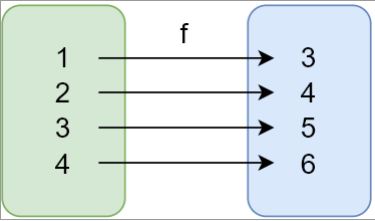
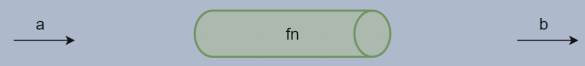
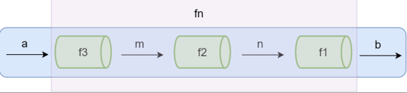

## 函数式编程
* 学习函数式编程的目的
    - 函数式编程随react流行受到更多关注
    - vue3 开始拥抱函数式编程
    - 函数式编程可以抛弃this
    - 打包过程中可以更好的利用tree shaking过滤无用代码
    - 方便测试、方便并行处理
    - 很多库可以帮助我们进行函数式开发 lodash underscore ramda 
### 函数式编程概念
函数式编程（Function Programming,FP）是编程范式之一。常说的编程范式还有面向过程编程、面向对象编程。
+ 面向对象的编程：把现实世界中的事物抽象成程序世界中的类和对象，通过封装、继承和多态来演示事物之间的联系。
+ 函数式编程：把现实世界的事物和事物之间的联系抽象到程序世界（对运算过程进行抽象）
    - 程序的本质：根据输入通过某种运算获得相应的输出，程序开发过程中会涉及很多有输入和输出的函数。
    - x-->f(联系、映射)-->y   y=f(x)
    - 函数式编程中的函数指的不是程序中的函数（方法），而是数学中的函数即映射关系，例如 ： y=sin(x) x和y 的关系
    - 相同的输入始终要得到相同的输出（纯函数）
    - 函数式编程用来描述数据（函数）之间的映射   
    [代码](./func/func001.js)

### 函数是一等公民
体现在：[mdn 头等函数](https://developer.mozilla.org/zh-CN/docs/Glossary/First-class_Function)
* 函数可以存储在变量中
* 函数可以作为参数
* 函数可以作为返回值
在JS中函数就是一个普通的对象（new Function()） 。我们可以把函数存在变量、数组中，还可以作为另一个函数的参数和返回值。可以在程序运行时通过new Function()来构造一个新的函数。   
[代码](./func/firstFun.js)

### 高阶函数
+ 高阶函数
    - 可以把函数作为参数传递给另一个函数[代码](./func/01-higher-order-fn.js)
    - 可以把函数作为另一个函数的返回结果[代码](./func/02-higher-order-fn.js)
+ 高阶函数的意义
    - 抽象可以帮我们屏蔽细节，只需关注我们的目标
    - 高阶函数用来抽象通用的问题
* 常用的高阶函数 [代码](./func/03-array-method.js)
    - forEach
    - map
    - filter
    - every
    - some
    - find/findIndex
    - reduce
    - sort
    - .....

### 闭包
+ Closure：函数和其周围的状态（词法环境）的引用捆绑到一起形成闭包。
    - 可以在另一个作用域中调用一个函数的内部函数并访问到该函数的作用域中的成员[代码](./func/02-higher-order-fn.js)
+ 闭包的本质：函数在执行的时候会放到一个执行栈上，当函数执行完后从执行栈上移除，但是堆上的作用域成员因为被外部引用而不能释放，因此内部函数依然可以访问外部函数的成员。[代码](./func/04-closure.js)

### 纯函数
+ 纯函数：相同的输入永远得到相同的输出，而且没有任何可观察的副作用。
    - 纯函数就类似数学中的函数（用来描述输入和输出之间的关系） y=f(x)  


+ [lodash](https://lodash.com/docs/#curry) 是一个一致性、模块化、高性能的JS实用工具库（lodash的fp模块提供了对函数式编程友好的方法），提供了对数组、数字、对象、函数等操作的一些方法。[代码演示](./func/06-lodash.js)
+ 数组的slice和splice分别是纯函数和不纯的函数。[代码](./func/05-purefun.js)
    - slice返会数组中指定部分，不改变原数组
    - splice对数组进行操作返回该数组，改变原数组
+ 函数式编程不会保留计算中间的结果，所以变量是不可变的（无状态）
+ 我们可以把一个函数的执行结果交给另一个函数去处理
#### 纯函数的好处
+ 可缓存
    - 因为纯函数对相同的输入失踪有相同的输出，所以可以把纯函数的结果保存起来
    - 模拟实现memoize函数[代码](./func/07-memoize.js)
+ 可测试
    - 纯函数让测试更方便
+ 并行处理
    -  在多线程环境下并行操作共享的内存数据很可能会出现意外的情况
    -  纯函数不需要访问共享的内存数据，所以在并行环境下可以任意运行纯函数（Web Worker）   
### 副作用
+ 纯函数：对于相同的输入永远会得到相同的输出，而且没有任何可观察的副作用。  
副作用让一个函数变得不纯，纯函数的根据相同的输入返回相同的输出，如果函数依赖于外部的状态就无法保证输出相同，就会带来副作用。[代码](./func/08-fuzuoyong.js)  
+ 副作用来源：  
  - 配置文件
  - 数据库
  - 获取用户的输入等   

所有的外部交互都有可能带来副作用，副作用也使得方法通用性下降不适合扩展和可重用性，同时副作用会给程序中带来安全隐患，但是副作用不可能完全禁止，尽可能控制他们在可控范围内发生。

### 柯里化（Haskell Brooks Curry）
+ 使用柯里化解决上一个案例中硬编码的问题[代码](./func/09-curry.js)
+ 柯里化（currying）
    - 当一个函数有多个参数的时候先传递一部分参数调用它（这部分参数以后永远不变）
    - 然后返回一个新的函数接受剩余的参数，返回结果。

### lodash中的柯里化函数
+ _.curry(func)[代码](./func/10-curry-lodash.js)
    - 功能 ：创建一个函数，该函数接受一个或多个func的参数，如果func所需要的参数都被提供则执行func并返回执行的结果，否则继续返回该函数并等待接受剩余的参数。
    - 参数： 需要柯里化的函数
    - 返回值： 柯里化后的函数
    [代码](./func/11-curry-demo.js)
+ 模拟_.curry()的实现[代码](./func/12-curry.js)
#### 总结
* 柯里化可以让我们给一个函数传递较少的参数得到一个已经记住了某些固定参数的新函数。
* 这是一种对函数参数的’缓存‘
* 让函数变得更灵活，让函数的粒度更小
* 可以把多元函数转换成一元函数，可以组合使用函数产生强大的功能。

### 函数组合
+ 纯函数和柯里化很容易写出洋葱代码
    - 获取数组的最后一个元素再转换成大写字母 _.toUpper(_.first(_.reverse(arr)))
+ 函数组合可以让我们吧细粒度的函数重新组合生成一个新的函数
#### 管道
下图便是程序中使用函数处理数据的过程，给fn函数输入参数a，返回结果b。可以想象a数据通过一个管道得到了b数据。
   
当fn函数比较复杂的时候，可以把fn拆分成多个小函数，此时多了中间运算过程中产生的m和n。  
下图可以想象把fn这个管道拆分成3个管道f1,f2,f3，数据a通过管道f3得到结果m,m再通过管道f2得到结果n,n通过管道f1得到最终结果b.
  
fn = compose(f1,f2,f3)   
b = fn(a)  
#### 函数组合
+ compose : 如果一个函数要经过多个函数处理才能得到最终值，这个时候可以把中间过程的函数合并成一个函数。
    - 函数就像是数据的管道，函数组合就是把这些管道连接起来，让数据穿过多个管道形成最终结果。
    - 函数组合默认从右到左执行   
[代码](./func/13-compose.js)

* lodash中的组合函数 flow()或flowRight() 
[代码演示](./func/14-compose-lodash.js)
* 模拟实现lodash的flowRight方法
[代码演示](./func/15-compose.js)
* 函数的组合要满足结合律[代码](./func/16-compose-associativity.js)
    - 既可以把g和h组合，还可以把f和g组合，结果都是一样的
#### 组合调试
* 组合调试 [代码](./func/17-compose-debug.js)
* lodash/fp
    lodash的fp模块提供了实用的对函数式编程友好的方法
[代码](./func/18-compose-lodash-fp.js)

### Point Free
我们可以把数据处理的过程定义成与数据无关的合成运算，不需要用到代表数据的那个参数，只是把简单的运算步骤合成到一起，在实用这种模式之前我们需要定义一些辅助的基本运算函数。
* 不需要指明处理的函数
* 只需要合成运算过程
* 需要定义一些辅助的基本运算函数
const f = fp.flowRight(fp.join('-'),fp.map(_.toLower),fp.split(' '))  
[代码](./func/19-point-free.js)

### 函子（Functor）
在函数式编程中如何把副作用控制在可控的范围内、异常处理、异步操作等。  
#### 函子？
* 容器：包含值和值的变形关系（这个变形关系就是函数）
* 函子：是一个特殊的容器，通过一个普通的对象来实现，该对象具有map方法，map方法可以运行一个函数对值进行处理（变形关系）

+ 总结
    - 函数式编程的运算不直接操作值，而是由函子完成
    - 函子就是一个实现了map锲约的对象
    - 可以把函子想象成一个盒子，这个盒子里封装了一个值
    - 想要处理盒子中的值，我们需要给盒子的map方法传递一个处理值的函数（纯函数），由这个函数来对值进行处理
    - 最终map方法返回一个包含新值的盒子（函子）
+ 在Functor中如果我们传入null或undefined  
[代码](./functor/01-functor.js)   

#### MayBe函子
对错误做响应的处理。  
MayBe的作用就是对外部的空值情况做处理（控制副作用的允许的范围）  
[代码](./functor/02-maybe.js)  
在MayBe函子中，很难确认是哪一步产生的空值问题。

#### Either函子
两者中的任何一个，类似if...else...的处理   
异常会让函数变得不纯，Either函子可以用来做异常处理  
[代码](./functor/03-either.js)

#### IO函子
IO函子中的_val是一个函数，这里是把函数作为值来处理。  
IO函子可以把不纯的动作存储到_val中，延迟执行这个不纯的操作（惰性执行），把不纯的操作交给调用者来处理。
[代码](./functor/04-io.js)

#### Task异步执行
使用folktale中的Task来演示。   
[folktale](https://folktale.origamitower.com/)是一个标准的函数式编程库。
只提供了一些函数式处理操作，如compose、curry等 一些函子Task、Either、MayBe等  
[代码](./functor/05-folktale.js)   
task异步执行  
[代码](./functor/06-task.js)   

#### Pointed函子
Pointed函子是实现了of静态方法的函子   
of方法是为了避免使用new来创建对象，更深层的含义是of方法来把值放到上下文Context（把值放到容器中，使用map来处理）

```
class Contains{
    static of(val){
        return new Contains(val)
    }
    ...
}
Contains.of(2).map(x=>x+1)
```

#### Monad（单子）
一个函子如果具有join和of两个方法并遵守一些定律就是一个Monad   
[代码](./functor/07-monad-pre.js)  
[代码](./functor/08-monad.js)


参考资料：
[函数式编程指北](https://llh911001.gitbooks.io/mostly-adequate-guide-chinese/content/ch1.html)  
[函数式编程入门](http://www.ruanyifeng.com/blog/2017/02/fp-tutorial.html)  
[Pointfree 编程风格指南](http://www.ruanyifeng.com/blog/2017/03/pointfree.html)  
[图解 Monad](http://www.ruanyifeng.com/blog/2015/07/monad.html)  
[Functors, Applicatives, And Monads In Pictures](http://adit.io/posts/  2013-04-17-functors,_applicatives,_and_monads_in_pictures.html)
  

## 异步编程
#### 同步&异步
[同步](./asynchronous/01-sync.js)   
[异步](./asynchronous/02-async.js)
#### 回调
[回调](./asynchronous/03-cb.js)
#### promise
[promise基本示例](./asynchronous/04-promise-sample.js)  
[promise-ajax](./asynchronous/05-promise-ajax.js)
```
// 嵌套使用 Promise 是最常见的误区
ajax('/api/urls.json').then(function (urls) {
  ajax(urls.users).then(function (users) {
    ajax(urls.users).then(function (users) {
      ajax(urls.users).then(function (users) {
        ajax(urls.users).then(function (users) {

        })
      })
    })
  })
})
```
[promise链式调用](./asynchronous/06-promise-chaining.js)  

[promise异常处理](./asynchronous/07-promise-catch.js)  

[微任务](./asynchronous/08-microtask.js)  

#### generator
[generator](./asynchronous/09-generator.js)
```
function * main () {
  try {
    const users = yield ajax('/api/users.json')
    console.log(users)

    const posts = yield ajax('/api/posts.json')
    console.log(posts)

    const urls = yield ajax('/api/urls11.json')
    console.log(urls)
  } catch (e) {
    console.log(e)
  }
}

function co (generator) {
  const g = generator()

  function handleResult (result) {
    if (result.done) return // 生成器函数结束
    result.value.then(data => {
      handleResult(g.next(data))
    }, error => {
      g.throw(error)
    })
  }

  handleResult(g.next())
}

co(main)
```
#### async/await

```
async function main () {
  try {
    const users = await ajax('/api/users.json')
    console.log(users)

    const posts = await ajax('/api/posts.json')
    console.log(posts)

    const urls = await ajax('/api/urls.json')
    console.log(urls)
  } catch (e) {
    console.log(e)
  }
}

// co(main)
const promise = main()

```

[本节课思维导图](https://naotu.baidu.com/file/12ab8156238ca036c9f7f205fb8a9d11)


* 柯里化
* flowRight（模拟）
* Point Free


## 第一次直播
#### 闭包
发生闭包的必要条件
  1、在函数外部对函数内部有引用
  2、在另一个作用域中调用 函数作用域中的内部成员
使用闭包可以突破变量作用域的限制，原来只能从一个作用域访问外部作用域的成员，有了闭包之后，可以在外部访问一个内部作用域的成员
可以缓存参数，根据不同参数生成不同功能的函数
#### 函数式编程

#### EventLoop
宏任务
微任务
