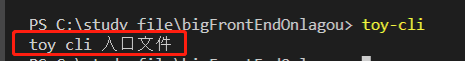
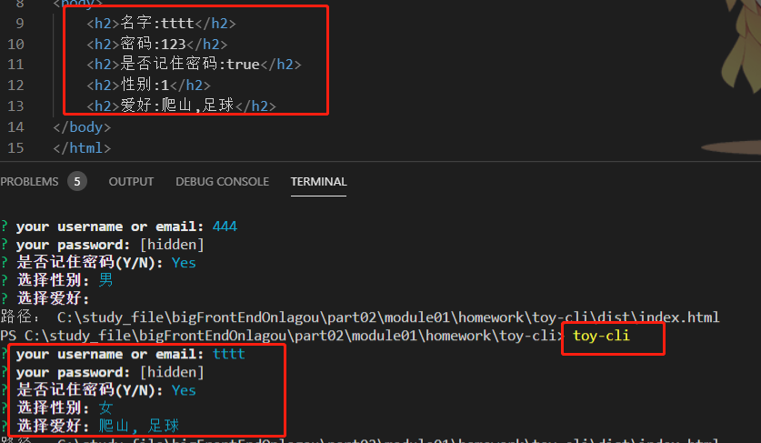
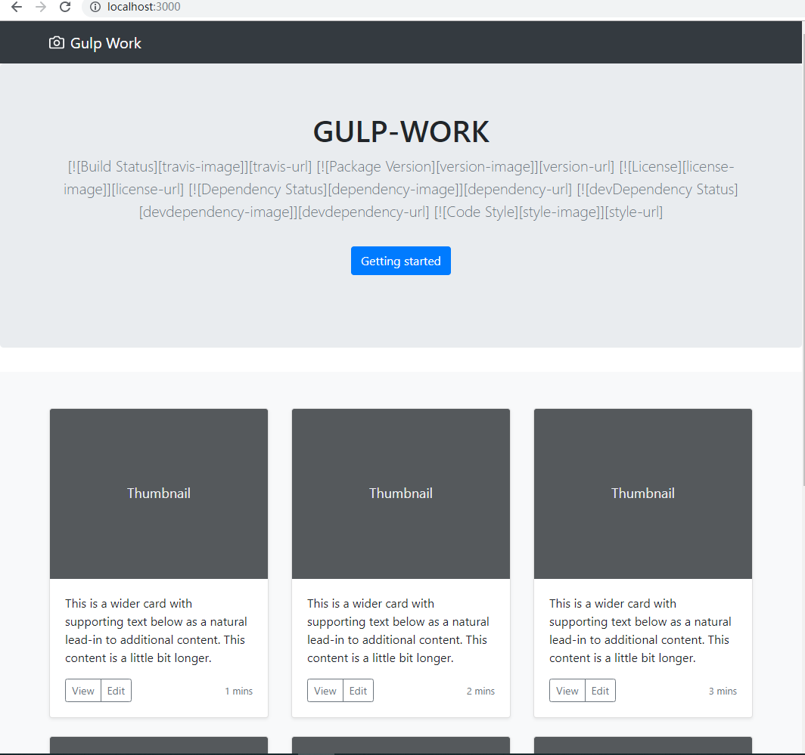

#### 简答题
1、谈谈你对工程化的初步认识，结合你之前遇到过的问题说出三个以上工程化能够解决问题或者带来的价值。
工程化就是通过一些方法去提升研发效率和研发质量的手段。  
+ 提升效率
    - 脚手架
    - 自动化构建
    - 组件化
    - 模块化
+ 保证质量
    - ESlint代码检测
    - git commit提交规范
    - 单元测试

2、你认为脚手架除了为我们创建项目结构，还有什么更深的意义？
* 提升效率，可以快速搭建一个基础项目架构
* 规范化 对技术选型、项目结构等做一些规范，以降低沟通成本

#### 编程题
1、概述脚手架实现的过程，并使用 NodeJS 完成一个自定义的小型脚手架工具
+ 实现过程
    - 创建一个仓库(目录)
    - 通过`npm init` 初始化
    - 创建一个入口js文件
    - package.json 文件增加`"bin":"入口文件路径"`
    - 通过`npm link`命令连接全局
    - 命令行运行脚手架命令
    - 后面可以通过`npm publish`发布到npm仓库
+ 实操 ( toy-cli 文件夹)
    - 1、创建一个目录toy-cli,在改目录下执行`npm init -y`初始化
    - 2、目录下创建bin文件夹,文件夹下新建index.js文件
    ```
    #! /usr/bin/env node 
    // index.js初始内容
    console.log('toy cli 入口文件');
    ```
    - 3、package.json增加一行`"bin":"bin/index.js"`
    - 4、通过`npm link `命令链接到全局
    - 5、命令行运行`toy-cli` 就能看到在index.js文件中的log语句输出了
    
    - 6、剩下的工作就是在index.js 文件写自定义逻辑了  
    demo：通过命令行询问的方式，让用户输入、选择一些信息，然后通过fs模块读取模板文件，使用ejs渲染数据后写入到项目目录的dist文件夹下。
    结果：   
    
    [主要代码片段](./toy-cli/bin/index.js)   
   


2、尝试使用 Gulp 完成 项目 的自动化构建
+ 主要任务[任务配置](./gulp-work/gulpfile.js)
    - gulp-sass 编译scss文件
    - gulp-babel  编译JS
    - gulp-imagemin 处理图片、 字体
    - 拷贝静态资源
    - gulp-swig 处理HTML模板文件
    - browser-sync 搭建开发服务器
    - 监听文件改变
    - gulp-useref gulp-if文件引用处理
    - gulp-load-plugins 自动加载插件
+ 组合任务
    - develop 用于开发环境
    - build 用于生产
    
    ```
    const develop = series(parallel(style,js,html),ref, server)
    const build = series(clean,parallel(style,js,html,img,extra,font))
    ```
+ package.json配置脚本
```
 "scripts": {
    "dev": "yarn gulp develop",
    "build":"yarn gulp build"
  },
```

3、使用 Grunt 完成 项目 的自动化构建
+ 主要任务(这个项目主要做了以下几个任务)[任务配置](./grunt-work/gruntfile.js)
    -  grunt-sass 编译scss文件
    -  grunt-babel编译ES6--->ES5
    -  grunt-contrib-watch 监听文件改变
    -  grunt-contrib-clean 清除编译后的文件
    -  grunt-contrib-copy 拷贝静态文件
    -  grunt-contrib-uglify 压缩js文件
+ 组合任务
    - develop 用于开发环境 编译scss、编译ES6、监听文件改变
    - default 用于生产  拷贝静态文件、清除编译后的文件、编译scss、编译ES6、,压缩JS
    ```
    grunt.registerTask('develop',['sass','babel','watch'])
    grunt.registerTask('default',['clean','copy','sass','babel','uglify'])
    ```
+ 配置package.json脚本

```
 "scripts": {
    "dev":"yarn grunt develop",
    "build":"yarn grunt"
  },
```


