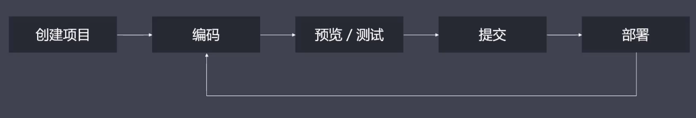
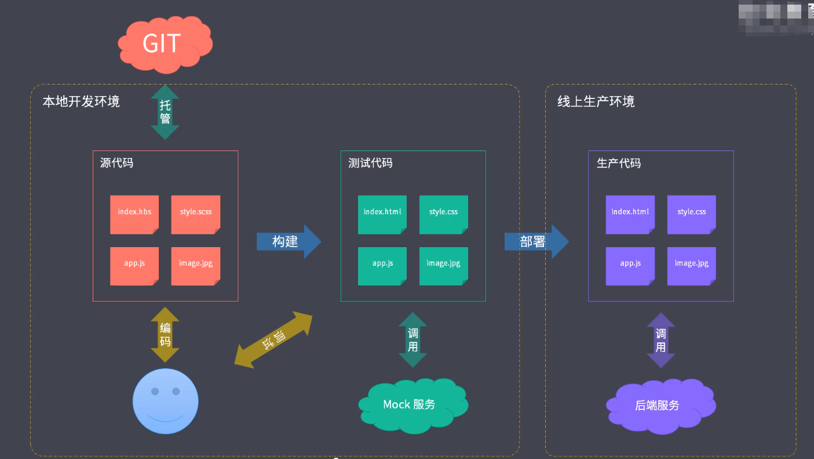
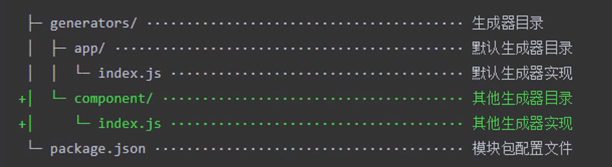

## 工程化概述
+ 面临的问题 
    - ES6+  兼容问题
    - Less、Sass等 不支持
    - 模块化、组件化不支持
    - 手动压缩
    - 手动上传代码 
    - 多人开发，难以统一风格
    - 等待后端接口完成
    - .....
+ 主要解决的问题
    - 传统语言或语法的弊端
    - 无法使用模块化、组件化
    - 重复的机械式工作
    - 代码风格统一、质量保证
    - 依赖后端服务接口支持
    - 整体依赖后端项目
+ 工程化的表现
    - 一切重复的工作都应该被自动化


+ 工程化不等于某个工具

    - vue-cli
    - create-react-app
    - angular-cli 
    - .....
+ 工程化与node
    - 前端工程化由node驱动

## 脚手架工具开发
+ 脚手架的本质
    - 创建项目基础结构、提供项目规范和约定
        - 相同的组织结构
        - 相同的开发范式
        - 相同的模块依赖
        - 相同的工具配置
        - 相同的基础代码
    - 前端脚手架
+ 常用的脚手架工具
    - create-react-app
    - vue-cli
    - angular-cli 
    - yeoman
    - plop(用于创建特定类型文件)
+ yeoman
    - 基本使用
        - 在全局安装yo ` yarn global add yo `
        - 安装对应的generator 如:生成node模块 `yarn global add generator-node`
        - 通过yo运行generator `yo node`
    - generator 
        - sub generator `yo node:cli`
+ yeoman 常规使用步骤
    - 明确需求
    - 找到合适的generator
    - 全局安装找到generator
    - 通过yo运行对应的generator
    - 通过命令式交互行填写选项
    - 生成所需的项目结构
    - 例子： generator-webapp
+ 自定义generator (基于yeoman)的实现
    - 创建generator本质上就是创建一个npm模块
    - generator基本结构
    
    
    -  名称约定  ```generator-<name>```
    - 操作
        - 新建目录generator-sample
        - yarn init 
        - yarn add yeoman-generator
        - 按目录结构创建文件[代码](./generator-sample/generators/app/index.js)
        -  npm link 
        - yo sample 
    - 根据模块创建文件[代码](./generator-sample/generators/app/index.js)
    - 接收用户输入[代码-prompting](./generator-sample/generators/app/index.js)
    - vue Generator案例   
        [代码](./generator-qy-vue/generators/app/index.js)
        - 注意 使用`yo <name> `之前
            - 使用npm link
            - 安装yeoman-generator
    - 发布generator(实际就是发布npm模块)(淘宝镜像是只读的)
        - npm public 
        - yarn public  --registry=https://registry.yarnpkg.com

+ plop (小型脚手架工具)
    - 重复创建相同类型的文件
    - 基本使用
        - npm i plop -D
        - plopfile.js文件 -- 定义任务 [参考代码](./plop/plopfile.js)
        - 编写模块 [参考代码](./plop/components.hbs)
        - yarn plop component 

+ 脚手架的工作原理
    - 实操
        - 创建目录cli-test
        - npm init 
        - 修改package.json  增加` "bin": "cli.js",`
        - 创建cli.js文件 [参考代码](./cli-test/cli.js)
        - npm link
        - 命令行运行 cli-test
    - 原理
        - 通过命令行交互询问用户问题
        - 根据用户回答生成文件


## 自动化构建系统
源代码---(自动化构建)-->生产代码
1、初体验  
* 创建auto-build目录
* 创建index.html \ main.scss文件
* 安装sass 
*  .\node_modules\.bin\sass 查看sass命令
* .\node_modules\.bin\sass .\part02\module01\auto-build\main.scss .\part02\module01\auto-build\style.css 编译scss文件为css文件
* 安装browser-sync
* 配置npm script
* 安装npm-run-all(run-p 命令)
```
  "build":"sass .\\part02\\module01\\auto-build\\main.scss .\\part02\\module01\\auto-build\\style.css",
    "serve":"browser-sync ./part02/module01/auto-build",
    "start":"run-p build serve"
```
2、常用的自动化构建工具
+ grunt
    - 构建速度慢
+ gulp
    - 同时执行多个任务
    - 生产文件存于内存
+ fis
    - 资源加载、性能优化等集成
3、grunt
+ grunt 基本使用
    - 安装grunt 
    - 目录下新建gruntfile.js文件[参考代码](./grunt-demo/gruntfile.js)
    - `yarn grunt foo`执行
+ grunt 标记任务失败[参考代码](./grunt-demo/gruntfile.js)
    -  return false
    - done(false)异步任务
+ grunt的配置方法[参考代码](./grunt-demo/gruntfile.js)
+ grunt多目标任务
    ```
        // 多目标任务 options不会当做子任务 而是配置 子任务的option会覆盖上层的options
    grunt.initConfig({
        build:{
            options:{
                foo:'foo'
            },
            js:1,
            css:{
                options:{
                    foo:'bar'
                }
            }
        }
    })
    grunt.registerMultiTask('build',function(){
        console.log(this.options());
        console.log(`target:${this.target},data:${this.data}`);
    })
    ```
+ grunt插件的使用
    - 安装grunt-contrib-clean 
    - grunt.loadNpmTasks('grunt-contrib-clean') 加载
    ```
      grunt.initConfig({
        clean:{
            // temp:'temp/app.js',
            // temp:'temp/*.js',
            temp:'temp/**'
        }
    })
    grunt.loadNpmTasks('grunt-contrib-clean')
    ```
+ grunt常用插件
    - grunt-sass
        - 依赖sass模块
```
    const sass = require('sass')

module.exports = grunt =>{

    grunt.initConfig({
        sass:{
            options:{
                implementation:sass
            },
            main:{
                file:{
                    'dist/css/main.css':'src/scss/main.scss'
                }
            }
        }
    })
    grunt.loadNpmTasks('grunt-sass')

}
    
```
    
    
- grunt-babel
    - 依赖@babel/core @babel/preset-env
```
const loadGruntTasks = require('load-grunt-task') // 自动加载

module.exports = grunt =>{
    grunt.initConfig({
        babel:{
            options:{
                presets:['@babel/preset-env']
            },
            main:{
                files:{
                    'dist/js/app.js':'src/js/app.js'
                }
            }
        }
    })
    loadGruntTasks(grunt)
}
```
- grunt-contrib-watch
```
 watch:{
            js:{
                files:['src/js/*.js'],
                tasks:['babel']
            },
            css:{
                files:['src/scss/*.scss'],
                tasks:['sass']
            }
        }
```
4、gulp  
+ 基本使用 
    - 安装gulp
    - 创建入口文件 gulpfile.js文件 [参考代码](./glup-demo/gulpfile.js)
    - `yarn gulp <taskName>`

+ 组合任务
```
const {series,parallel} = require('gulp')
const task1 = done=>{
    setTimeout(()=>{
        console.log('task1');
        done();
    },1000)
}
const task2 = done=>{
    setTimeout(()=>{
        console.log('task2');
        done();
    },1000)
}
const task3 = done=>{
    setTimeout(()=>{
        console.log('task3');
        done();
    },1000)
}

exports.foo = series(task1,task2,task3); // 串行
exports.bar = parallel(task1,task2,task3);//并行同步执行
```


+ 异步任务
```
const fs = require('fs')
exports.cb = done=>{
    console.log('cb task');
    done()
}

exports.cb_error = done =>{
    console.log();
    done(new Error('task failed!'))
}

exports.promise = ()=>{
    console.log('promise task');
    return Promise.resolve()
}
exports.promise_error = ()=>{
    console.log('promise task');
    return Promise.reject(new Error('task failed'))
}

const timeout = time =>{
    return new Promise(resolve=>{
        setTimeout(resolve,time)
    })
}
exports.async = async ()=>{
    await timeout(1000)
    console.log('async task');
}

// exports.stream = ()=>{
//     const readStream  = fs.createReadStream('package.json')
//     const writeStream = fs.createWriteStream('temp.txt')
//     readStream.pipe(writeStream)
//     return readStream
// }


exports.stream = done =>{
    const readStream  = fs.createReadStream('package.json')
    const writeStream = fs.createWriteStream('temp.txt')
    readStream.pipe(writeStream)
    readStream.on('end',()=>{
        done()
    })
}
```
+ gulp构建过程核心原理
    - 读出文件---转换---写入
```
const fs = require('fs')
const {Transform} = require('stream')
exports.default = ()=>{
    // 文件读取
    const read = fs.createReadStream('a.css')
    // 文件写入流
    const write = fs.createWriteStream('a.min.css')

    const transform = new Transform({
        transform:(chunk,encoding,cb)=>{
            const input = chunk.toString();
            const output = input.replace(/\s+/g,'').replace(/\/\*.+?\*\//g,'')
            cb(null,output)
        }
    })
    // 把读取出来的文件流导入写入文件流
 
    read.pipe(transform).pipe(write);
    return read
}
```
+ 文件操作API + 插件的使用
```
const {src,dest} = require('gulp')
const cleanCss = require('gulp-clean-css')
const rename = require('gulp-rename')

exports.default = ()=>{
    return src('a.css')
        .pipe(cleanCss())
        .pipe(rename({extname:'.min.css'}))
        .pipe(dest('dist'))
}
```

+ 案例：样式编译
```
const { src, dest } = require('gulp')
const sass = require('gulp-sass')
const style = () => {
    return src('src/assets/style/*.scss', { base: 'src' })
        .pipe(sass({outputStyle:'expanded'}))
        .pipe(dest('dist'))
}

module.exports = {
    style
}
```
+ 案例：脚本编译
```
const babel = require('gulp-babel')
const script = ()=>{
    return src('src/assets/scripts/*.js', { base: 'src' })
    .pipe(babel({presets:['@babel/preset-env']}))
    .pipe(dest('dist'))
}
```
+ 案例：页面模板编译
```
const swig = require('gulp-swig')
const page = ()=>{
    return src('src/*.html', { base: 'src' })
    .pipe(swig())
    .pipe(dest('dist'))
}
```
+ 案例：图片和字体文件转换
```
const imagemin = require('gulp-imagemin')
const image = ()=>{
    return src('src/assets/images/**', { base: 'src' })
        .pipe(imagemin())
        .pipe(dest('dist'))
}
const font = ()=>{
    return src('src/assets/font/**', { base: 'src' })
        .pipe(imagemin())
        .pipe(dest('dist'))
}
```

+ 案例：其他文件及文件清除
```
// 主要是拷贝文件
const extra = ()=>{
    return src('public/**', { base: 'public' })
        .pipe(dest('dist'))
}

// del插件
const del = require('del')
const clean = ()=>{
    return del(['dist'])
}
// 构建之前清除
const build = series(clean,parallel(compile,extra))

```
+ 案例：自动加载插件

```
const gulpLoadPlugins = require('gulp-load-plugins')
const plugins = gulpLoadPlugins()
// 使用时 通过plugins.sass 的方式

const style = () => {
    return src('src/assets/style/*.scss', { base: 'src' })
        .pipe(plugins.sass({ outputStyle: 'expanded' }))
        .pipe(dest('dist'))
}
```
+ 案例：开发服务器 (热更新)
```
const browserSync = require('browser-sync')
const bs = browserSync.create()


const server = () => {
    bs.init({
        server:{
            baseDir:'dist'
        }
    })
}
```

+ 案例：监视变化及构建优化
```
const { src, dest, parallel ,series,watch} = require('gulp')
const server = () => {
    watch('src/assets/style/*.scss',style)
    watch('src/assets/scripts/*.js',script)
    watch(['src/assets/images/**','src/assets/font/**'],bs.reload)

    bs.init({
        notify:false,//关闭右上角的tip
        port:2080,//端口 
        open:false,//关闭自动打开浏览器
        files:'dist/**',// 监听的目录
        server:{
            baseDir:'dist',
            routes:{
                '/node_modules':'node_modules'
            }
        }
    })
}
```
+ 案例：useref文件引用处理
```
<!-- 构建注释 -->
<!-- build:css assets/styles/vendor.css -->
<link rel='stylesheet' href='node_modules/bootstrap/dist/css/bootstrap.css'>
<!-- endbuild-->

const useref = ()=>{
    return src('dist/*.html',{base:'dist'})
        .pipe(plugins.useref({searchPath:['dist','.']}))
        .pipe(dest('dist'))
}
```
+ 案例：文件压缩
```
const useref = ()=>{
    return src('dist/*.html',{base:'dist'})
        .pipe(plugins.useref({searchPath:['dist','.']}))
        // html js css
        // gulp-html gulp-uglify gulp-clean-css
        .pipe(plugins.if(/\.js$/,plugins.uglify()))
        .pipe(plugins.if(/\.html$/,plugins.htmlmin({collapseWhitespace:true})))
        .pipe(plugins.if(/\.css$/,plugins.cleanCss()))

        .pipe(dest('release'))
}

```
useref打乱了之前的构建流程。

+ 案例：重新规划构建过程


5、封装自动化构建工作流
+ 准备
    - 新建一个项目（含远程仓库）
    - 安装zce-cli

+ 提取gulpfile
    - 将gulp-demo中的gulpfile.js 文件内容复制到gxw-pages项目下的lib/index.js(入口文件)中
    - 将gulp-demo中的package.json中安装的依赖复制到gxw-pages的package.json的dependencies
    - 删除gulp-demo项目中的依赖、清空gulpfile.js
    - gxw-pages项目通过yarn link 链接到本地全局
    - 在gulp-demo项目中通过`yarn link "gxw-pages"` 链接到本项目
    - gulp-demo项目中gulpfile.js添加代码`module.exports = require('gxw-pages')`
    - gulp-demo项目中安装一下依赖（原本项目依赖）
    - 安装一下gulp-cl、gulp
    - 运行脚本`yarn gulp clean`

+ 解决模块中的问题
    - gulp-demo项目中创建page.config.js文件(目的是抽离出一些配置信息)
    - 在gxw-pages项目中lib/index.js加载配置文件
    
    ```
    const cwd = process.cwd();// 返回当前命令行工作目录
    let config = {
        // default config
    }
    try {
        const loadConfig = require(`${cwd}/pages.config.js`)
        config = Object.assign({},config,loadConfig)
    } catch (error) {
        
}
    ```
    - 将gxw-pages项目中lib/index.js用到的相关配置改成加载过来的数据
    ```
    const page = () => {
    return src('src/*.html', { base: 'src' })
        .pipe(swig({ data: config.data }))
        .pipe(dest('dist'))
}
    ```
+ 抽象路径配置
    - 把写死的路径改成可配置的
    ```
    let config = {
  // default config
  build:{
    src:'src',
    dist:'dist',
    temp:'temp',
    public:'public',
    paths:{
      styles:'assets/style/*.scss',
      scripts:'assets/scripts/*.js',
      pages:'*.html',
      images:'assets/images/**',
      fonts:'assets/font/**'
    }
  }
}
const style = () => {
    return src(config.build.paths.styles, { base: config.build.src,cwd:config.build.src})
        .pipe(sass({ outputStyle: 'expanded' }))
        .pipe(dest('dist'))
}

    ```
+ 包装gulp cli
    - gulp-demo项目中gulpfile.js删除
    - `yarn gulp build --gulpfile .\node_modules\gxw-pages\lib\index.js` 
    - yarn gulp build --gulpfile .\node_modules\gxw-pages\lib\index.js --cwd . (指定当前目录为工作目录)
    - 上面的方法传参太多
    - 解决：在gxw-pages项目中提供一个cli
        - 在gxw-pages项目新建bin/gxw-pages.js
        - 在package.json中配置"bin":"bin/gxw-pages.js"
        ```
        #!/usr/bin/env node 
        process.argv.push('--cwd')
        process.argv.push(process.cwd())
        process.argv.push('--gulpfile')
        process.argv.push(require.resolve('..'))

        require('gulp/bin/gulp')

        ```
        -  gxw-pages clean·
+ 发布使用 [gwx-pages](https://github.com/demong89/gxw-pages.git)
    - package.json文件files增加
    ```
     "files": [
        "lib",
        "bin"
    ],
    ```
    -  npm publish (要先登录)
    -  npm i  gwx-pages 在其他项目中使用


6、Fis (高度集成、内置webserver)
+ 基本使用
    - 安装fis3 
    - yarn fis3 release (默认构建任务)
    - yarn fis3 release  -d  dist  (指定输出目录)
    - 配置文件fis-conf.js
+ 编译与压缩
    - yarn fis3 inspect 查看编译过程
```
// 安装 fis-parser-node-sass
fis.match('**/*.scss',{
    rExt:'.css',// 修改扩展名
    parser:fis.plugin('node-sass'),
    optimizer:fis.plugin('clean-css')//压缩
})

// 安装 
fis.match('**/*.js',{
    parser:fis.plugin('babel-6.x'),
    optimizer:fis.plugin('uglify-js')
})


```


