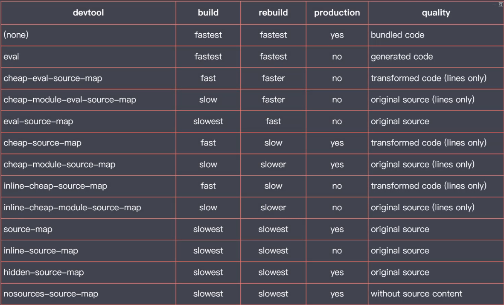
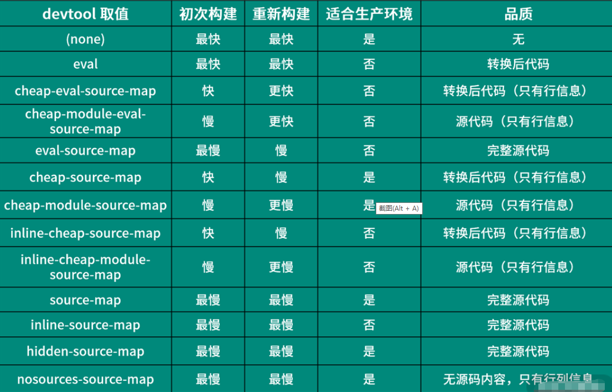
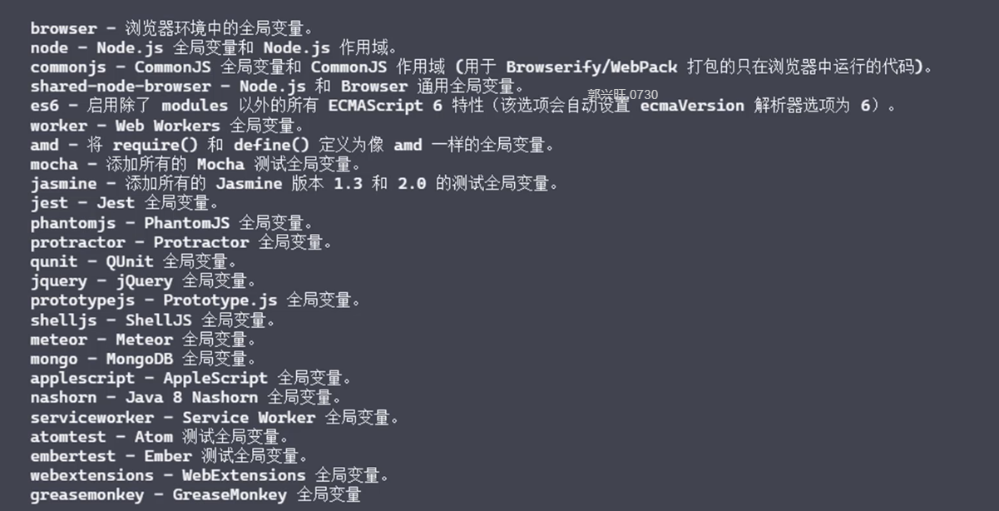

## 模块化
+ 模块化演变过程  
    - step1 -- 文件划分方式
        - 命名冲突
        - 污染全局作用域
        - 无法管理模块间的依赖关系
    - step2 -- 命名空间的方式
        - 将每个模块添加命名空间
        - 依然没有解决模块间的依赖关系
    - step3 -- IIFE
        -  通过函数提供私有作用域
    - step4 -- commonjs规范（node）
        - 一个文件就是一个模块
        - 每个模块都有单独的作用域
        - 通过module.exports导出成员
        - 通过require函数载入模块
        - 以同步的方式加载
    - step4 -- AMD（浏览器端）---require.js
        - define(名字,依赖项数组,回调函数)
        - require(模块数组,回调函数)
        - 使用复杂、模块JS请求频繁
    - step4 -- CMD --- sea.js    

+ 模块化规范(统一)  
    - ES Modules (浏览器)
    - commonjs规范（node）
+ ES Modules
    - 基本特性[演示代码](./es-module/01-features.html)
        - ES module 自动采用严格模式，忽略'use strict'
        - 每个ES module 都是运行在单独的私有作用域中
        - ES module是通过CORS的方式请求外部JS模块的
        - ES module的script标签会延迟执行脚本  相当于defer属性
    - 导入导出
        - export\import [演示代码](./es-module/02-export.html)
        - 注意事项
            - export { } -- 这里不是对象字面量，是固定的语法
            - export default {} -- 这里就是对象字面量
            - import {} form 'xx'  -- 这里也不是解构，是固定的语法
            - export { name }  导出的是引用关系，这个是只读的
    - import
        - import {ss} from './xxx' form后面是完整路径 ./不可省略(或/) 完整的URL也行
        - import {} from './xxx' 或者 import  './xxx'  加载模块 但是不提取变量
        - import * as mod from './xxx'  提取全部成员
        - import关键字只能出现在最顶层  import('./xxx').then() 动态加载模块
        - 同时导入命名和默认成员 import { name  ,default as title }  from './xx' 或 import title , {name} from './xxx'
    - 导出导入成员 
        - import {name} form './xxx'  ---> 改为  export {name} form './xxx' 
    - 浏览器环境 polyfill [演示代码](./es-module/03-polyfill.html)
        - nomodule属性 在不支持es module的浏览器上生效
    - ES module in Node  [演示代码](./es-module/04-node-esm.mjs)
        - 文件扩展名为.mjs
        - node --experimental-modules .\04-node-esm.mjs 执行
        - import {camelCase} from 'lodash' // 不能使用这种方式载入第三方模块
        - import { writeFileSync } from 'fs' 可以提取node自身模块
    - ES module in Node 与 commonJS交互[演示代码](./es-module/05-esm-common.mjs)
        - ES module中可以导入commonJS模块，只能导入默认的成员
        - commonJS中不能导入ES module模块
    - ES module in Node 与 commonJS差异[演示代码](./es-module/06-esm.mjs)
        
    - ES module in Node 新版本支持
        - node 12.10.0 
        - package.json 添加 `{"type":"module"}`
        - 文件后缀使用.js 不是.mjs
        - commonJS 的文件后缀需要改为 .cjs
    - ES module in Node Babel兼容方案[代码](./es-module/07-babel.js)
        - @babel/node  @babel/core @babel/preset-env 
        - .babelrc presets
        - .babelrc plugins

        
## webpack

+ 模块打包工具(要解决的问题)
    - es modules存在环境兼容问题
    - 模块文件过多，网络请求频繁
    - 所有资源文件都需要模块化 
    - 工具
        - webpack
            - loader
            - 代码拆分
            - 资源模块
        - rollup
        - parcel
    
+ webpack 快速上手
    - webpack webpack-cli 安装
    - webpack 命令 
+ webpack 配置文件
    - webpack.config.js
    ```
    const path = require('path')

    module.exports = {
        entry:'./src/main.js',
        output:{
            filename:'bundle.js',
            path:path.join(__dirname,'output')// 必须是绝对路径
        }
}
    ```
+ webpack 工作模式 mode
    - webpack --mode develop(production\none) 
    - webpack.config.js 中 ` mode:'development'`

+ webpack 打包结果运行原理
    - mode 设置为none
    - 运行调试bundle
+ webpack 资源模块加载
    - css-loader
    - style-loader
+ webpack 导入资源模块
    - import './main.css'

+ webpack 文件资源加载器
    - file-loader (output配置publicPath)
+ webpack URL加载器(data urls)
    - url-loader 对于超出limit的 还是会调用file-loader
    - 小文件使用，使用data urls 
    - 大文件单独存放
    ```
    {
                test:/\.png$/,
                use:{
                    loader:'url-loader',
                    options:{
                        limit:10*1024
                    }
                }
            }
    ```
+ webpack 常用加载器分类
    - 编译转换类
        - css-loader
        - babel-loader
    - 文件操作类
        - file-loader
    - 代码检查类
        - eslint-loader

+ webpack 与 ES2015
    - 由于打包需要，处理import和export
    - babel-loader
    ```
                {
                test:/\.js$/,
                loader:{
                    loader:'babel-loader',
                    options:{
                        presets:['@babel/preset-env']
                    }
                }
            
    ```
+ webpack 加载资源的方式
    - 遵循ES module 标准的import声明 
    - 遵循CommonJS标准的require函数 -- require().default
    - 遵循AMD标准的define和require函数
    - HTML src  href (html-loader)
    ```
    {
                test: /\.html$/,
                use: {
                    loader: 'html-loader',
                    options: {
                        attributes: {
                            list: [
                                {
                                    tag: 'img',
                                    attribute: 'src',
                                    type: 'src',
                                },
                                {
                                    tag: 'a',
                                    attribute: 'href',
                                    type: 'src',
                                }
                            ]
                        }
                    }
                }
            },
    ```
    - @import \ url函数`background-image: url('./1.png');`
    - [注意]不要混合使用 

+ webpack 核心工作原理
    - 打包入口-->依赖-->依赖树-->找到资源文件(loader)--->打包

+ webpack 开发一个loader
    - 实现一个markdown-loader
    - 实现步骤
        - 创建一个文件markdown-loader.js [参考代码](./webpack/markdown-loader.js)
        - 配置webpack.config.js
        ```
        {
                test:/\.md$/,
                use:'./markdown-loader'
            },
        ```
        - 使用marked模块解析md文件
    

+ webpack 插件机制
    - 解决除了loader的工作之外的自动化构建工作
    - 实现大部分工程化的工作

+ webpack 自动清除输出目录
    - clean-webpack-plugin 

+ webpack 自动生成HTML插件
    - html-webpack-plugin
    - 注意 ：这里如果使用的是全局的webpack打包 会报错
     `Cannot find module 'webpack/lib/node/NodeTemplatePlugin'`
     使用npm link 链接到本地就行了
    -  使用 多个new HtmlWebpackPlugin()实例 配置多个页面文件

    - copy-webpack-plugin 复制静态文件

+ webpack 开发一个插件
    - 通过钩子机制实现
    - 插件必须是一个函数或者一个包含apply方法的对象
    ```
        class MyPlugin {
        apply(compiler) {
            console.log('自定义插件');
            compiler.hooks.emit.tap('MyPlugin', compilation => {
                // compilation  -->此次打包的上下文
                for (const key in compilation.assets) {
                    //    console.log(key);
                    //    console.log(compilation.assets[key].source());
                    if (key.endsWith('.js')) {
                        const content = compilation.assets[key].source();
                        const withOutComment = content.replace(/\/\*\*+\*\//g,'')
                        compilation.assets[key] = {
                            source:()=>withOutComment,
                            size:()=>withOutComment.length
                        }
                    }
                }
            })
        }
    }
    ```

+ webpack 开发体验问题
    - 开发环境设想
        - HTTP服务运行
        - 自动构建、刷新
        - sourcemap支持

+ webpack 自动编译
    - watch工作模式 - 监听文件
    - 运行`webpack --watch`

+ webpack 自动刷新浏览器
    - browser-sync
+ webpack Dev server
    - 安装 webpack-dev-server 
    - 运行 `webpack-dev-server --open`
    - 打包结果存放在内存中
    - 静态资源的访问
    ```
     devServer:{
        contentBase:'src'
    },

    ```
    - 代理API
        - 跨域问题
        ```
         proxy:{
            '/api':{
                target:'https://api.github.com',
                pathRewrite:{
                    '^/api':''
                },
                changeOrigin:true
            }
        }
        ```

+ webpack sourcemap 
    - 错误信息代码定位
    - 映射源代码和装换后的代码之间的关系
    - //# sourceMappingURL=jquery-3.4.1.min.map
    - 配置 `devtool:"source-map"`

+ webpack devtool模式对比

    - eval -- 是否使用eval执行代码模块
    - cheap -- sourcemap是否包含行信息
    - module -- 是否能够得到loader处理之前的源代码
    - 选择合适的sourcemap
        - 开发 
            - cheap-module-eval-source-map 
        - 生产 
            - none
            - nosources-source-map

+ webpack HMR 
    - webpack-dev-server --hot
    - hot:true + 插件 new webpack.HotModuleReplacementPlugin()
+ webpack 处理JS模块热替换
    - HMR API 
    ```
    // ./main.js

    // ... 原本的业务代码

    module.hot.accept('./editor', () => {
    // 当 ./editor.js 更新，自动执行此函数
    console.log('editor 更新了～～')
    })

    ```
    - 

+ webpack 处理图片模块热替换
    ```
    // ./src/main.js
    import logo from './icon.png'
    // ... 其他代码
    module.hot.accept('./icon.png', () => {
    // 当 icon.png 更新后执行
    // 重写设置 src 会触发图片元素重新加载，从而局部更新图片
    img.src = logo
    })

    ```

#### webpack 生产环境优化
- 生产环境注重运行效率
- mode(模式)
    
+ webpack 不同环境的配置文件
    - 配置文件根据环境不同导出不同配置
    ```
    module.exports = (env,args)=>{
        if(env==='production'){}
    }
    ```
    - 一个环境对应一个配置文件(webpack-merge合并模块)
        - webpack.base.js
        - webpack.dev.js
        - webpack.prod.js


+ webpack DefinePlugin
    - 为代码注入全局变量 process.env.NODE_ENV
    ```
    new webpack.DefinePlugin({
        API_BASE_URL:'"http://exmple.com"'
    })
    ```
+ webpack Tree Shaking
    - 未引用代码
    - 一组功能搭配后的效果，生成模式自动开启
    - 其他模式下开启
        ```
        optimization:{
            usedExports:true,// 标记未引用代码
            minimize:true,//移除未使用代码
        },
        ```
    - treeShaking 和Babel
        - 由webpack打包的代码必须使用esmodule
        - 打包--loader(可能转换为commonJS的方式)--代码，Tree Shaking失效
        ```
          {
                test: /\.js$/,
                loader: {
                    loader: 'babel-loader',
                    options: {
                        presets: [['@babel/preset-env',{modules:'commonjs'}]]
                    }
                }
            },
            // modules:false// 确保不会开启esmodule的转换 Tree Shaking就不会失效
        ```
+ webpack 合并模块 
    - concatenateModules(scope Hoisting)

+ webpack sideEffects副作用
    - 允许我们标识代码是否是副作用代码
    - 一般用于npm包标记是否有副作用
    ```
    optimization:{
        sideEffects:true,//副作用
    },

    package.json中配置
    sideEffects:false // 标识不是副作用
    ```
    - 注意
        - 确保代码没有副作用
        - 载入的css模块
        ```
        // package.json
        sideEffects:['src/xxx','xxx.css']
        ```
+ webpack 代码分割
    - 分包，按需加载
    - HTTP1.1 限制请求个数、请求头浪费资源
    - 分包方式
        - 多入口打包
            - 一个页面对应一个打包入口
            ```
             entry:{
                index:'src/index.js',
                album:'src/album.js'
            },
            output: {
                filename: '[name].bundle.js',
                path: path.join(__dirname, 'output'),// 必须是绝对路径
            },
            new HtmlWebpackPlugin({
                chunks:['index']//指定页面引用
            }),

            ```
            - 提取公共模块
            ```
             optimization:{
                splitChunks:{
                    chunks:'all'
                }
            }
            ```
        - 动态导入
            - 会被自动分包
            - `import('./posts').then(({default:posts})=>{})`
            - 魔法注释  
                `import(/* webpackChunkName:'posts' */'./posts').then(({default:posts})=>{})`

+ webpack MiniCssExtractPlugin
    - 提取css模块  
    - 安装`mini-css-extract-plugin`
    ```
    new MiniCssExtractPlugin()
    {
        test: /\.css$/,
        use: [MiniCssExtractPlugin.loader, 'css-loader']
    },
    ```
+ webpack OptimizationCssAssetsWebpackPlugin
    - 压缩输出CSS
    - 安装 `optimize-css-assets-webpack-plugin`
    ```
     optimization:{
        minimizer:[
            new OptimizeCssAssetsWebpackPlugin(),
            new TerserWebpackPlugin()
        ]
    },
    // 配置后 默认JS压缩失效，因为webpack认为我们要自定义压缩
    // 需要手动开启new TerserWebpackPlugin()  插件为：terser-webpack-plugin
     
    ```
+ webpack 输出文件名hash
    - filename属性
        - hash ` filename: '[name].[hash].js',`
        - chunkhash 根据打包入口的路径不同 
        - contenthash 不同的文件不同的hash

## rollup
更为小巧，是一款ESM打包器
+ 快速上手
    - 安装rollup
    - `yarn rollup ./src/index --format iife  --file dist/bundle.js`
+ 配置文件
    - rollup.config.js
    - `yarn rollup ./src/index --config rollup.config.js`

+ 使用插件(插件是rollup唯一的扩展途径)
    - 安装`rollup-plugin-json`
    - 配置
    ```
    import json from 'rollup-plugin-json'
    export default{
        input:'src/index.js',
        output:{
            file:'dist/bundle.js',
            format:'cjs'
        },
        plugins:[
            json()
        ]
    }
    ```

+ 加载npm模块
    - `rollup-plugin-node-resolve`
+ 加载commonJS模块
    - `rollup-plugin-commonjs`
+ 代码拆分
    - `import('./logger').then()`
+ 多入口打包
    -  `input:['src/index.js','src/album.js'],`
    - `input:{
        foo:'src/index.js',
        bar:'src/album.js'
    },`
+ 选用原则
    - rollup 优点
        - 输出结果更扁平
        - 自动移除未引用代码
        - 打包结果依然完全可读
    - rollup 缺点
        - 加载非ESM的第三方模块比较复杂
        - 模块最终都被打包到一个函数中，无法实现HMR
        - 浏览器环境中，代码拆分功能依赖AMD库(require.js)
    - 应用程序(不适用)
    - js类库(适合) -- 知名框架(react\vue)

## parcel - 零配置的前端应用打包器
+ 安装`parcel-bundler`
+ 运行`yarn parcel src/index.html` 
    - 默认开启一个开发服务器
    - 模块热替换
    - 自动安装依赖
    - 动态导入
+ 生产模式 `yarn parcel build src/index.html` 


## 规范化标准
+ 为什么需要规范化标准
    - 软件开发需要多人协同
    - 不同开发者具有不同的编码习惯和喜好
    - 不同的喜好增加项目维护成本
    - 每个项目或者团队需要明确统一的标准
+ 哪里需要规范化
    - 代码、文档、甚至是提交日志
    - 开发过程中人为编写的成果物
    - 代码标准化规范最为重要
+ 实施规范化的方法
    - 编码前人为的标准约定
    - 通过工具实现 Lint

+ ESLint
    - ESLint介绍
        - js Lint工具监测JS代码质量
        - ESLint很容易统一开发者的编码风格
        - ESLint可以帮助开发提升编码能力
    - ESLint上手
        - 安装`npm i eslint -D `
        - `npx eslint --init`
        - `npx eslint .\01-prepare.js --fix`
    - 配置项
    ```
    module.exports = {
    env: {//标记当前代码运行环境
      browser: true,//浏览器环境
      es2020: true
    },
    extends: [// 集成共享配置
      'standard'
    ],
    parserOptions: {//设置语法解析器
      ecmaVersion: 11
    },
    rules: {
        'no-alert':'error'
    }
  }
    ```
    
    
    - ESLint配置注释
        - eslint-disable-line <rule-name>
    - 与gulp集成
        - 克隆[项目](https://github.com/zce/zce-gulp-demo.git)
        - 安装依赖
        - 安装eslint
        - 安装gulp-eslint
        ```
        const script = () => {
        return src('src/assets/scripts/*.js', { base: 'src' })
            .pipe(plugins.eslint())
            .pipe(plugins.eslint.format())
            .pipe(plugins.eslint.failAfterError())
            .pipe(plugins.babel({ presets: ['@babel/preset-env'] }))
            .pipe(dest('temp'))
            .pipe(bs.reload({ stream: true }))
        }
        ```
        - `npm eslint --init `生成配置文件
    - 与webpack集成
        - 克隆[项目](https://github.com/zce/zce-react-app.git)
        - 安装依赖
        - 安装eslint
        - 安装eslint-loader
        - 初始化.eslintrc.js
        ```
          {
        test: /\.js$/, 
        exclude: /node_modules/, 
        use: 'eslint-loader',
        enforce:'pre'
      },
        ```
        - `eslint-plugin-react` 
        ```
         rules: {
            'react/jsx-uses-react':2,
            'react/jsx-uses-vars':2
        },  
        plugins:[
            'react'
        ]

        // 或者
         extends: [
            'standard',
            'plugin:react/recommended'
        ],
        ```
    - 现代化项目集成ESLint
        - vue or react脚手架
    - ESlint 检测TS 
        - .eslintrc.js文件配置 `parser:'@typescript-eslint/parser'`
+ Stylelint -- css代码检测
    - 提供默认的代码检测规则
    - 提供cli工具，快速调用
    - 通过插件支持Sass Less PostCSS
    - 支持Gulp或webpack集成
    - 使用
        - 安装stylelint
        - npx stylelint 
        - .stylelintrc.js配置文件
        - 安装stylelint-config-standard插件
        - 校验sass `stylelint-config-sass-guidelines`

+ Pretier的使用
    - 通用代码格式化工具
    - 安装 `npm i prettier -D`
    - `npm prettier style.css --write` 
+ Git Hooks工作机制
    - 在代码提交前强制lint
    - git hooks(git 钩子)，每个钩子对应一个任务
    - 通过shell脚本可以编写钩子任务触发时要具体执行的操作
    - pre-commit 
+ ESLint结合Git Hooks
    - husky可以实现githooks的使用需求
    - 安装husky 
    - package.json  
    ```
    husky:{
        "hooks":{
            "pre-commit":"npm run test"
        }
    }
    ```
    - 安装`lint-stage`
    -   
      ```
      "husky":{
        "hooks":{
            "pre-commit":"npm run precommit"
        }
    },
    "lint-stage":{
        "*.js":['eslint','git add']
    }
    ```