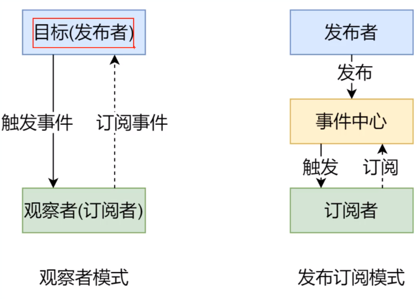

## vue基础
+ 基本结构
+ 生命周期
+ 语法
    - {{}}
    - 指令
    - 计算属性 监听器
    - class和style绑定
    - 条件渲染/列表渲染
    - 表单输入绑定
    - 组件
    - 插槽
    - 插件
    - 混入mixin
    - 响应式原理
    - 不同构件版本的vue

## vue-router实现

+ 基本使用
    - 创建路由组件
    - vue.use()注册vue-router
    - 注册router对象
    - 设置占位router-view
    - 创建链接 router-link
+ 动态路由
    - /detail/:id
        - [获取]$route.params.id
        - [获取]props:true  --- 推荐
    - ()=> import()
+ 嵌套路由
    - children
+ 编程式导航
    - $router.push()
    - $router.replace()
    - $router.go()
+ hash和history模式的区别
    - hash 带# 
        - 基于锚点以及onhashchange事件
        - #后面的内容作为路径地址
        - 根据当前路由地址找到对应组件重新渲染
    - history
        - 基于HTML5 API
            - history.pushState()改变地址栏   IE10以后才支持
            - history.replaceState()
            - 监听popstate事件
            - 根据当前路由地址找到对应组件重新渲染
        - mode:'history'
        - 使用需要服务器端的支持
            - 单页应用中，服务端不存在http://www.testurl.com/login这样的地址会返回找不到该页面
            - 在服务端应该除了静态资源外都返回单页应用的index.html
        - node中配置(express)
            - `const history = require('connect-history-api-fall-back')`
            - `app.use(history())`
        - nginx中配置 
            - nginx配置步骤
                - 下载、解压(目录不能有中文)
                - 命令行
                    - start nginx 
                    - nginx -s reload
                    - nginx -s stop
                - html 文件夹中(打包后的资源)
                - conf/nginx.conf `try_files $uri $uri/ /index.html`
                ```
                server{
                    location / {
                        try_files $uri $uri/ /index.html
                    }
                }
                ```
+ vue-router实现原理
    - 使用的vue前置知识
        - 插件
        - 混入
        - Vue.observable()
        - 插槽
        - render函数
        - 运行时和完整版的vue
    - 模拟实现
        - 分析
            - 类图
            
        - install方法实现
        ```
            let _Vue = null;
            export default class VueRouter{
                static install(Vue){
                    // 1 判断当前插件是否已安装
                    if(VueRouter.install.installed) return;
                    VueRouter.install.installed = true;
                    // 2 把Vue构造函数记录到全局变量
                    _Vue = Vue
                    // 3 把创建vue实例时候传入的router对象注入到Vue实例上
                    // 混入
                    _Vue.mixin({
                        beforeCreate(){
                            if(this.$options.router){ // 如果是组件的话 不存在router 
                                _Vue.prototype.$router = this.$options.router
                            }
                        }
                    })
                    
                }
            }
        ```
        - 构造函数
        ```
        constructor(options){
            this.options = options;
            this.routerMap = {};// key 路由地址 value 路由组件
            this.data = _Vue.observable({
                current:'/'
            })
        }
        ```
        - createRouteMap
        ```
        createRouteMap(){
            //把构造函数中传过来的routes转换为key-value形式，存放在routerMap中
            this.options.routes.forEach(route=>{
                this.routerMap[route.path] = route.component
            })
        }
        ```
        - initComponents(router-link) 
        ```
         initComponents(Vue){
            Vue.component('router-link',{
                props:{
                    to:String
                },
                template:`<a :href='to'><slot></slot></a>`
            })
        }
        ```
        - 完整版Vue
            - vue的构建版本
                - 运行时版：不支持template模板，需要打包的时候提前编译
                - 完整版 ：包含运行时和编译器，体积比运行时版大10K左右，程序运行的时候把模板转换成render函数
            - vue.config.js(解决1)
            ```
            module.exports = {
                runtimeCompiler:true
            }
            ```
            - render(解决2)
                ```
                       Vue.component('router-link', {
                        props: {
                            to: String
                        },
                        //   template: '<a :href=\'to\'><slot></slot></a>'
                        render (h) {
                            return h('a', {
                            attrs: {
                                href: this.to
                            }
                            }, [this.$slots.default])
                        }
                        })
                ```

        - router-view
        ```
             Vue.component('router-view', {
                render (h) {
                    const component = _this.routerMap[_this.data.current]
                    return h(component)
                }
            })
            // router-link配合点击事件
              Vue.component('router-link', {
                props: {
                    to: String
                },
                //   template: '<a :href=\'to\'><slot></slot></a>'
                render (h) {
                    return h('a', {
                    attrs: {
                        href: this.to
                    },
                    on: {
                        click: this.clickHandler
                    }
                    }, [this.$slots.default])
                },
                methods: {
                    clickHandler (e) {
                    history.pushState({}, '', this.to)
                    this.$router.data.current = this.to
                    e.preventDefault()
                    }
                }
            })
        ```
        - initEvent
        ```
        initEvent () {
            window.addEventListener('popstate', () => {
            this.data.current = window.location.pathname
            })
        }
        ```


## 模拟vue实现
+ 数据驱动
    - 数据响应式
        - 数据模型仅仅是普通的JS对象，而当我们修改数据时，视图会进行更新，避免频繁的DOM操作，提高开发效率
    - 双向绑定
        - 数据改变，视图改变；视图改变，数据也随之改变
        - 使用v-model在表单元素上创建双向数据绑定
    - 数据驱动是vue最独特的特性之一
        - 开发过程中仅需要关注数据本身，不需要关心数据是如何渲染到试图的
+ vue2响应式原理
    - Object.defineProperty[代码](./my-vue/01-defineProperty.html)
+ vue3响应式原理
    - proxy 直接监听对象
    - 由浏览器进行性能优化
+ 发布订阅模式 [代码](./my-vue/02-event-emitter.html)
    - 订阅者
    - 发布者
    - 信号中心

+ 观察者模式 [代码](./my-vue/03-dep-watch.html)
    - 观察者（订阅者） - Watcher
        - update()  当事件发生时，具体要做的事情
    - 目标（发布者） - Dep
        - subs数组 存储所有的观察者
        - addSub()  添加观察者
        - notify()  当事件发生，调用所有观察者的update()方法
    - 没有事件（信号）中心
+ 观察者VS发布订阅
    - 观察者模式：由具体目标调度，比如当事件触发、Dep就会去调用观察的方法，所以观察者模式的订阅者和发布者之间存在依赖的。
    - 发布订阅：由统一调度中心调用，因此发布者和订阅者不需要知道对方的存在。
 

+ 模拟vue实现（学习版）
    - 结构
     
    - Vue类 
        - 功能
            - 负责接收初始化参数
            - 负责把Data中的属性注入到Vue实例，转换成getter/setter
            - 负责调用observer监听data中所有属性的变化
            - 负责调用compiler解析指令/插值表达式
        - 结构
            - $options
            - $el
            - $data
            - _proxyData()
    - Observer类
        - 功能
            - 负责把data选择中的数据属性转换成响应式数据
            - data中的某个属性也是对象，把该属性转换成响应式数据
            - 数据变化发送通知
        - 结构
            - walk(data)
            - defineReactive(data,key,value)
    - Compiler类
        - 功能
            - 负责编译模板，解析指令/插值表达式
            - 负责页面的首次渲染
            - 当数据变化后重新渲染视图
        - 结构
            - el
            - vm
            - compile(el)
            - compileElement(node)
            - compileText(node)
            - isDirective(attrName)
            - isTextNode(node)
            - isElementNode(node)    
    - Dep 
        - 功能
            - 收集依赖，添加观察者
            - 通过所有的观察者
        - 结构
            - subs
            - addSub(sub)
            - notify()
    - Wather
        - 功能
            - 当数据变化触发依赖，dep通知所有的Watcher实例更新视图
            - 自身实例化的时候往dep对象中添加自己
        - 结构
            - vm
            - key 
            - cb 
            - oldValue
            - update() 

 

## VDOM的实现原理
+ VDOM 
    - 用JS对象描述DOM对象
    - 为什么使用VDOM？
        - 手动操作DOM麻烦，要考虑浏览器兼容
        - 为了简化DOM的复杂操作出现了MVVM框架，MVVM框架解决了视图和状态的同步问题
        - 为了简化视图的操作可以使用模板引擎，但模板引擎没有解决跟踪状态变化的问题，于是有了VDOM
        - VDOM的好处是当状态改变时不需要立即更新DOM，只需要创建一个虚拟树来描述DOM。VDOM内部会弄清楚如何有效（diff）的更新DOM
        - VDOM可以维护程序的状态，跟踪上一次的状态
        - 通过比较前后两次状态的差异更新真实DOM
    - VDOM作用
        - 维护视图和状态的关系
        - 复杂视图情况下提升渲染性能
        - 除了渲染DOM以外，还可以实现SSR(nuxt/next)、原生应用(Weex/RN)、小程序(uni-app)等

+ VDOM库 - Snabbdom/virtual-dom
    - Snabbdom
        - Vue2 内部虚拟DOM就是改造后的Snabbdom
        - 约200行
        - 通过模块可扩展
        - 源码使用TS
        - 最快的VDOM之一
    - Snabbdom使用
        - 使用parcel打包
            - npm init -y 
            - npm i parcel-bundler -D
            - package.json
            ```
            "scripts": {
                "dev":"npx parcel index.html --open",
                "build":"npm parcel build index.html"
            },
             ```
            - 导入snabbdom`npm i snabbdom -D` [代码](./vdom/src/01-base.js)
                - init() 高阶函数，返回patch()[代码](./vdom/src/02-use-snabbdom.js)
                - h() 返回虚拟节点
                - thunk() 一种优化策略，可以在处理不可变数据时使用
            - snabbdom模块
                - attributes
                    - 设置DOM元素的属性，使用setAttribute()
                    - 处理布尔类型的属性
                - props
                    - 和attributes模块类似，设置DOM属性 element[attr] = value
                    - 不处理布尔类型的属性
                - class
                    - 切换类样式
                    - 主要：给元素设置类样式是通过sel选择器
                - dataset
                    - 设置data-*的自定义样式
                - eventlisteners
                    - 注册和移除事件
                - style
                    - 设置行内样式，支持动画
                    - delayed/remove/destroy
            - 模块的使用 [代码](./vdom/src/03-modules.js)
                - 导入需要的模块
                - init()中注册模块
                - 使用h()创建VNode的时候，可以把第二个参数设置为对象，其他参数往后移
            - snabbdom模块核心(源码)
                - 使用h()创建JS对象(VNode)描述真实DOM
                - vnode() 返回JS对象 描述VDOM 
                - init() 设置模块，创建patch()
                - patch(oldVnode,newVnode)比较新旧两个VNode ---- snabbdom.ts
                    - 把新节点中变化的内容渲染到真实的DOM。最后返回新节点作为下一次处理的旧节点
                    - 对比新旧VNode是否相同节点（节点的key和sel相同）
                    - 如果不是相同节点，删除之前的内容，重新渲染
                    - 如果是相同的节点，再判断新的VNode是否有text，如果有并且和oldVNode的text不同，直接更新文本内容
                    - 如果新的VNode有children，判断子节点是否有变化，判断子节点的过程使用的就是diff算法
                    - diff过程只进行同层级比较
                - 把变化的内容更新到真实DOM树上
                - 源码解析
                    - h()函数 --- src/h.ts
                        - 用来创建VNode(调用vnode函数返回虚拟节点)
                    - patch()  
                        - createElm() 把VDOM转为DOM，并触发init/create钩子函数
                        
                            - 1、执行init函数
                            - 2、把 VNode转为真实DOM对象（没有渲染到页面）
                            - 3、 返回新创建的DOM
                        - removeVnodes() 移除老节点
                            - 
                        - addVnodes()
                        - patchVnode() 对比新旧节点 更新差异
                        
                        - updateChildren() diff算法核心，对比新旧节点的children，更新DOM
                        
                    - init() 
                    


#### 如何学习源码
+ 先宏观了解
+ 带着目标看源码
+ 看源码过程要不求甚解
+ 调试
+ 参考资料


本节 （mini-vue实现、snabbdom源码）
