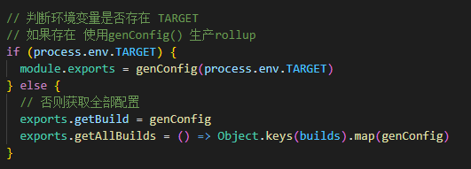
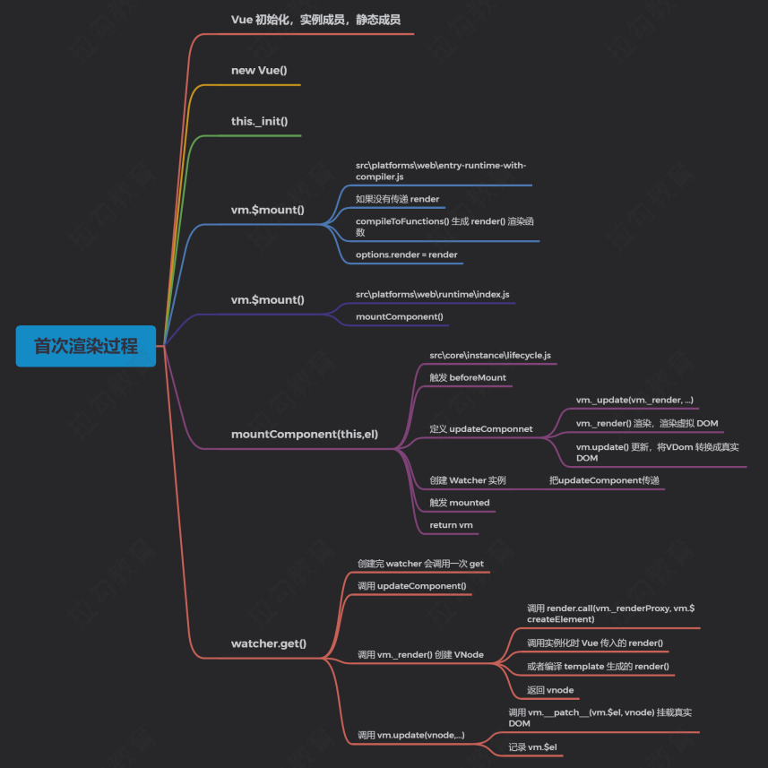

## 准备工作
#### Vue源码获取
[项目地址](https://github.com/vuejs/vue)
fork一份到自己仓库
[vue3.0地址](https://github.com/vuejs/vue-next)
#### 源码目录结构
 src
    - compiler  编译相关
    - core      Vue核心库
    - platforms 平台相关代码
    - server    SSR服务端渲染
    - sfc       .vue文件编译为JS对象
    - shard     公共的代码
#### Flow 
JS的静态类型检查器
[官网](https://flow.org/)
[参考-3、flow](https://blog.csdn.net/guo187/article/details/107052501)
#### 调试设置
+ 打包工具 Rollup
+ 安装依赖 `npm i`
+ 设置sourcemap
    - package.json文件中的dev脚本中添加参数 --sourcemap
    ` "dev": "rollup -w -c scripts/config.js --sourcemap --environment TARGET:web-full-dev",`
+ 执行dev
    `npm run dev` dist文件夹下出现vue.js文件
#### 调试
+ examples的示例中引入的vue.min.js改为vue.js
+ chrome调试工具source

## vue的不同构建版本
npm run build 重新打包

[参考](https://cn.vuejs.org/v2/guide/installation.html#%E5%AF%B9%E4%B8%8D%E5%90%8C%E6%9E%84%E5%BB%BA%E7%89%88%E6%9C%AC%E7%9A%84%E8%A7%A3%E9%87%8A)
+ 完整版：同时包含编译器和运行时的版本
+ 编译器：用来将模板字符串编译成为 JavaScript 渲染函数的代码。将template转换为render函数
+ 运行时：用来创建 Vue 实例、渲染并处理虚拟 DOM 等的代码。基本上就是除去编译器的其它一切。

+ UMD  UMD 版本通用的模块版本，支持多种模块方式。 vue.js 默认文件就是运行时 + 编译器的UMD 版本
+ commonjs(cjs) CommonJS 版本用来配合老的打包工具比如 Browserify 或 webpack 1。
+ ESM  从 2.6 开始 Vue 会提供两个 ES Modules (ESM) 构建文件，为现代打包工具提供的
版本。
    - ESM 格式被设计为可以被静态分析，所以打包工具可以利用这一点来进行“tree-shaking”并将用不到的代码排除出最终的包。
    - [ES6\commonJS区别](https://es6.ruanyifeng.com/#docs/module-loader#ES6-%E6%A8%A1%E5%9D%97%E4%B8%8E-CommonJS-%E6%A8%A1%E5%9D%97%E7%9A%84%E5%B7%AE%E5%BC%82)


+ 推荐使用运行时版本，因为运行时版本相比完整版体积要小大约 30%

+ 基于 Vue-CLI 创建的项目默认使用的是 vue.runtime.esm.js
 - 通过查看 webpack 的配置文件`vue inspect > output.js`
 注意： *.vue 文件中的模板是在构建时预编译的，最终打包后的结果不需要编译器，只需要运行
时版本即可

#### 去除源码报错
VScode-- 首选项--设置 搜validate  JavaScript validate 设为false

Babel JavaScript 插件 解决泛型下面代码不高亮的问题


## 入口文件
#### 查找入口文件
"dev": "rollup -w -c scripts/config.js --sourcemap --environment TARGET:web-full-dev"
+ script/config.js文件的执行
    - 作用：生成 rollup 构建的配置文件
    - 使用环境变量 TARGET = web-full-dev

+ genConfig(name)函数
    - 根据环境变量 TARGET 获取配置信息
    - builds[name] 获取生成配置的信息  builds是个对象 ` const opts = builds[name]`
+ resolve函数 - builds里用到
    - 获取入口和出口文件的绝对路径
把 src/platforms/web/entry-runtime-with-compiler.js 构建成 dist/vue.js，如果设置 --
sourcemap 会生成 vue.js.map  
src/platform 文件夹下是 Vue 可以构建成不同平台下使用的库，目前有 weex 和 web，还有服务
器端渲染的库   

#### 从入口文件开始
src/platforms/web/entry-runtime-with-compiler.js
Q：同时声明template和render ， 优先执行哪个？
```
const vm = new Vue({ el: '#app', template: '<h3>Hello template</h3>', render (h) { return h('h4', 'Hello render') } }) 
```
+ el不能是body 或者 HTML
+ 把 template/el 转换成render函数
+ 如果有render方法，直接调用mount方法 挂载DOM

#### vue的构造函数在哪里

+ src/platform/web/entry-runtime-with-compiler.js 中引用了  './runtime/index'
+ src/platform/web/runtime/index.js
    - 设置Vue.config
    ```
    Vue.config.mustUseProp = mustUseProp
    Vue.config.isReservedTag = isReservedTag
    Vue.config.isReservedAttr = isReservedAttr
    Vue.config.getTagNamespace = getTagNamespace
    Vue.config.isUnknownElement = isUnknownElement
    ```
    - 设置平台相关的指令和组件
        - 设置v-model、v-show `extend(Vue.options.directives, platformDirectives)`
        - 组件 transition 、 transition-group `extend(Vue.options.components, platformComponents)`
    - 设置平台相关的_patch_方法 （打补丁方法，对比新旧的VNode） `Vue.prototype.__patch__ = inBrowser ? patch : noop`
    - 设置$mount方法，挂载DOM 
    ```
    Vue.prototype.$mount = function (
        el?: string | Element,
        hydrating?: boolean
        ): Component {
        el = el && inBrowser ? query(el) : undefined
        return mountComponent(this, el, hydrating)
    }
    ```
+ src/platform/web/runtime/index.js 中引用了  'core/index'
+ src/core/index.js
 - 定义了Vue的静态方法
 - initGlobalAPI(Vue)
+ src/core/index.js 中引用了 './instance/index'
+ src/core/instance/index.js
    - 定义了vue的构造函数

#### 四个导出Vue的模块
+ src/platforms/web/entry-runtime-with-compiler.js
    - web平台相关的入口
    - 重写了平台相关的$mount方法
    - 注册了Vue.compile()方法，传递一个HTML字符串返回render函数 
+ src/platforms/web/runtime/index.js
    - web相关平台
    - 注册和平台相关的全局指令 v-model v-show
    - 注册和平台相关的全局组件 v-transition v-transition-group
    - 全局方法
        - _patch_  把虚拟DOM转换成真实的DOM
        - $mount 挂载方法
+ src/core/index.js
    - 与平台无关
    - 设置了vue的静态方法 initGlobalAPI(Vue)
+ src/core/instance/index.js
    - 与平台无关
    - 定义了构造函数，调用了this._init(options)方法
    - 给Vue中混入了常用的实例成员

## Vue的初始化
#### src/core/global-api/index.js
+ 初始化vue的静态方法
    - src/core/index.js
    ```
    // 注册vue的静态属性 、方法
    initGlobalAPI(Vue) 
    ```
#### src/core/instance/index.js
+ 定义vue的构造函数
+ 初始化vue的实例成员
+ initMixin(Vue)
    - 初始化_init()方法 // src\core\instance\init.js

## 首次渲染过程 

+ Vue初始化完毕，开始真正的执行
+ 调用new Vue() 之前，已经初始化完毕

## 数据响应式原理
#### Q
+ vm.msg = { count: 0 } ，重新给属性赋值，是否是响应式的？
+ vm.arr[0] = 4 ，给数组元素赋值，视图是否会更新
+ vm.arr.length = 0 ，修改数组的 length，视图是否会更新
+ vm.arr.push(4) ，视图是否会更新

#### 响应式处理的入口
+ src\core\instance\init.js
    - initState(vm) vm状态的初始化
    - 初始化了_data _props methods computed watch
+ src\core\instance\state.js
```
// 数据的初始化 initState()方法
  if (opts.data) {
    initData(vm)
  } else {
    observe(vm._data = {}, true /* asRootData */)
  }
```
+ initData(vm) vm数据的初始化 src\core\instance\state.js
+ src\core\observer\index.js
    - observe(value,asRootData)
    - 负责为每一个Object类型的value创建一个observer实例

#### Observer
+ src\core\observer\index.js 
    - 对对象做响应化处理
    - 对数组做响应化处理
+ walk(obj)
    - 遍历obj的所有属性，为每一个属性调用defineReactive() 设置getter / setter
#### defineReactive()
+ src\core\observer\index.js
+ defineReactive (obj,key,val,customSetter,shallow)
    - 为一个对象定义一个响应式的属性，每一个属性对应一个dep对象
    - 如果该属性的值是对象 继续调用observer
    - 如果给属性赋新值 继续调用observer
    - 如果数据更新发出通知
+ 对象响应式处理
+ 数组的响应式处理
    - Observer的构造函数中
    - 处理数据修改数据的方法
        - src\core\observer\array.js
#### Dep类
+ src\core\observer\dep.js
+ 依赖对象
+ 记录watcher对象
+ depend() -- watcher记录对应的dep
+ 发布通知
#### watcher类
+ watcher分三种 Computed Watcher、用户Watcher（侦听器） 、渲染Watcher
+ 渲染watcher的创建时机
    - /src/core/instance/lifecycle.js
+ 渲染watcher创建的位置lifecycle.js的mountComponent函数中
+ Watcher的构造函数初始化，处理expOrFn(渲染watcher和侦听器处理不同)
+ 调用this.get() 它里面调用pushTarget() 然后this.getter.call(vm,vm)(对于渲染watcher调用updateComponent)，如果是用户watcher会获取属性的值（触发get操作）
+ 当数据更新时，dep中调用notify()方法，notify()中调用watcher的update()方法
+ update()中调用queueWatcher()
+ queueWatcher()是一个核心方法 去除重复操作 调用flushSchedulerQueue()刷新队列并执行watcher
+ flushSchedulerQueue()中对watcher排序，遍历所有watcher， 如果有before，触发生命周期的钩子函数beforeUpdate，执行watcher.run(),它内部调用this.get() 然后调用this.cb()(渲染watcher的cb是noop)
+ 整个流程结束


## 实例方法/数据

#### vm.$set
+ 功能  
向响应式对象中添加一个属性，并确保这个新属性同样是响应式的，且触发视图更新。它必须用于响应式对象上添加新属性，因为vue无法探测普通的新增属性（如 this.myObject.newProperty='hi'）
注意：对象不能是vue实例，或者vue实例的跟数据对象
+ 位置 Vue.set()  global-api/index.js
+ vm.$set() instance/index.js
+ set() 方法 observer/index.js
#### vm.$delete
+ 功能 
删除对象的属性，如果对象是响应式的，确保删除能触发更新视图。这个方法主要用于避开vue不能检测到属性被删除的限制，
+ 注意：目标对象不能是一个vue实例或vue实例的根数据对象。
+ 定义位置 Vue.delete() global-api/index.js
+ vm.$delete() instance/index.js
+ 源码 src\core\observer\index.js
#### vm.$watch(expOrFn,callback,[options])
+ 功能 
观察vue实例变化的一个表达式或计算属性函数。回调函数得到的参数为新值和旧值。表达式只接受监督的键路径。对于更复杂的表达式，用一个函数取代。
+ 参数
    - expOrFn 要监视的$data中的属性，可以是表达式或函数
    - callback 数据变化后执行的函数
        - 函数 回调函数
        - 对象 具有handler属性（字符串或者函数），如果该属性为字符串则methods中相应的定义
    - options
        - deep 布尔型 深度监听
        - immediate 布尔型 是否立即执行一次回调函数

## 三种类型的watcher对象
+ 没有静态方法，因为$watch方法中要使用vue的实例
+ Watcher分三种：计算属性watcher、用户watcher（侦听器）、渲染watcher
+ 创建顺序： 计算属性watcher、用户watcher（侦听器）、渲染watcher
+ vm.$watcher()  src\core\instance\state.js

## 异步更新队列 - nextTick()
+ vue更新DOM是异步执行的，批量的
    - 在下次DOM更新循环结束之后执行延迟回调，在修改数据之后立即使用这个方法，获取更新后的DOM
+ vm.$nextTick(function(){ /*操作DOM*/}) / Vue.nextTick(function(){})
+ 定义位置 src\core\instance\render.js
+ 源码
    - 手动调用vm.$nextTick()
    - 在watcher的queueWatcher中执行nextTick()
    - src\core\util\next-tick.js

## 虚拟DOM
#### 什么是虚拟DOM
VDOM是使用JS对象来描述DOM，VDOM的本质就是JS对象，使用JS对象来描述DOM的结构。应用的各种状态变化首先作用于VDOM，最终映射到DOM。vue中VDOM借鉴了Snabbdom,并添加了一些vue中的特性，如指令和组件机制
Vue 1.x 中细粒度监测数据的变化，每一个属性对应一个 watcher，开销太大Vue 2.x 中每个组件对应一
个 watcher，状态变化通知到组件，再引入虚拟 DOM 进行比对和渲染
#### 为什么用虚拟DOM
+ 使用虚拟 DOM，可以避免用户直接操作 DOM，开发过程关注在业务代码的实现，不需要关注如何操作 DOM，从而提高开发效率
+ 作为一个中间层可以跨平台，除了 Web 平台外，还支持 SSR、Weex。
+ 关于性能方面，在首次渲染的时候肯定不如直接操作 DOM，因为要维护一层额外的虚拟 DOM，如果后续有频繁操作 DOM 的操作，这个时候可能会有性能的提升，虚拟 DOM 在更新真实 DOM之前会通过 Diff 算法对比新旧两个虚拟 DOM 树的差异，最终把差异更新到真实 DOM
#### vue中的虚拟DOM
+ render中的h函数 -- createElement()
+ 虚拟DOM创建过程
    - vm._init()
    - vm.$mount()
    - mountComponent()
    - 创建watcher对象
    - updateComponent()
    - vm._render()
        - vnode - render.call(vm._renderProxy,vm.$createElement)
        - vm.$createElement
            - h函数，用户设置的render函数中调用
            - createElement(vm,a,b,c,d,true)
        - vm._c()
            - h函数 模板编译的render函数中调用
            - createElement(vm,a,b,c,d,true)
        - _createElement()
            - vnode = new VNode(config,parsePlatformTagName(tag),data,children,undefined,undefined,context)
            - vm._render()结束，返回vnode
        - vm._update()
            - 负责把VDOM渲染成真实DOM
            - 首次执行
                - vm.__patch__(vm.$el,vnode,hydrating,false)
            - 数据更新
                - vm.__patch__(preVnode,vnode)
        - vm.__patch__()
            - runtime/index.js中挂载vue.prototype.__patch__
            - runtime/patch.js的patch函数
            - 设置modules和nodeOps
            - 调用createPatchFunction()函数返回patch函数
        - patch()
            - vdom/patch.js中的creatPatchFunction返回patch函数
            - 挂载cbs节点的属性/事件/样式操作的钩子函数
            - 判断第一个参数是真实DOM还是VDOM 首次加载，第一个参数就是真实DOM 转换成VNode 调用createElm
            - 如果是数据更新的时候，新旧节点是sameVnode执行patchVnode，就是diff
            - 删除旧节点
        - createElm(vnode,insertedVnodeQueue)
            - 把VDOM转为真实DOM 并插入到DOM树
            - 把虚拟节点的children，转为真实DOM 并插入到DOM树
        - patchVnode
            - 对比新旧VNode以及新旧VNode的子节点更新差别
            - 如果新旧VNode都有子节点并且子节点不同的话 调用updateChildren对比新旧子节点的差异
        - updateChildren
            - 从头和尾开始依次找到相同的子节点进行比较patchVnode，共有4种比较方式
            - 在老节点的子节点中查找newStartVnode 并进行处理
            - 如果新节点比老节点多，把新增的子节点插入到DOM中
            - 如果老节点比新节点多，把多余的老节点删除
#### createElement
+ 功能 用来创建Vnode ，render函数中的参数h ，就是createElement
+ 定义
    - 在vm._render()中调用了，用户传递的或者编译生成的render函数，这个时候传递了createElement
    - src/core/instance/render.js
    vm.c和vm.$createElement内部都调用了createElement，不同的是最后一个参数。vm.c在编译生成的render函数内部会调用。vm.$createElement在用户传入的render函数内部调用。当用户传入render函数的时候，需要对用户传入的参数做处理
    - src/core/vdom/create-element.js
    在执行完createElement之后创建好了VNode，把创建好的VNode传递给vm._update()继续处理
#### update
+ 功能 内部调用vm.__patch__()把VDOM转换为真实DOM
+ 定义 src/core/instance/lifecycle.js
#### patch函数初始化
+ 功能 对比两个VNode的差异，把差异更新到真实DOM。如果是首次渲染的话，会把真实DOM先转换成VNode
+ snabbdom中patch函数的初始化
    - src/snabbdom.ts
    - vnode函数
+ vue中patch函数的初始化
    - src/platforms/web/runtime/index.js
    - src/platforms/web/runtime/patch.js
    - src/core/vdom/patch.js
        - createElm() 把 VNode 转换成真实 DOM，插入到 DOM 树上
        - patchVnode()

## 模板编译和组件化
+ 模板编译的主要目的是将模板(template)转换成渲染函数(render)
+ 模板编译的作用
    - vue2.x使用vnode描述视图以及各种交互，用户自己编写vnode比较复杂
    - 用户只需要编写类似HTML的代码 -vue模板，通过编译器将模板转换为返回vnode的render函数
    - .vue文件会被webpack在构建过程中转换为render函数
+ 把 template 转换成 render 的入口  src\platforms\web\entry-runtime-with-compiler.js
#### Vue Template Explorer
+ Vue 2.6 把模板编译成 render 函数的工具
    -  [编译render 函数](https://template-explorer.vuejs.org/#%3Cdiv%20id%3D%22app%22%3E%0A%20%20%3Cselect%3E%0A%20%20%20%20%3Coption%3E%0A%20%20%20%20%20%20%7B%7B%20msg%20%20%7D%7D%0A%20%20%20%20%3C%2Foption%3E%0A%20%20%3C%2Fselect%3E%0A%20%20%3Cdiv%3E%0A%20%20%20%20hello%0A%20%20%3C%2Fdiv%3E%0A%3C%2Fdiv%3E)
+ Vue 3.0 beta 把模板编译成 render 函数的工具
    -  [编译render 函数](https://vue-next-template-explorer.netlify.app/#%7B%22src%22%3A%22%3Cdiv%20id%3D%5C%22app%5C%22%3E%5Cn%20%20%3Cselect%3E%5Cn%20%20%20%20%3Coption%3E%5Cn%20%20%20%20%20%20%7B%7B%20msg%20%20%7D%7D%5Cn%20%20%20%20%3C%2Foption%3E%5Cn%20%20%3C%2Fselect%3E%5Cn%20%20%3Cdiv%3E%5Cn%20%20%20%20hello%5Cn%20%20%3C%2Fdiv%3E%5Cn%3C%2Fdiv%3E%22%2C%22options%22%3A%7B%22mode%22%3A%22module%22%2C%22prefixIdentifiers%22%3Afalse%2C%22optimizeBindings%22%3Afalse%2C%22hoistStatic%22%3Afalse%2C%22cacheHandlers%22%3Afalse%2C%22scopeId%22%3Anull%7D%7D)

#### 模板编译过程
解析---优化---生成
+ 编译的入口
    - src\platforms\web\entry-runtime-with-compiler.js
    - 调试 compileToFunctions() 执行过程，生成渲染函数的过程
        - compileToFunctions: src\compiler\to-function.js
        - complie(template, options)：src\compiler\create-compiler.js
        - baseCompile(template.trim(), finalOptions)：src\compiler\index.js
###### 解析 parse
+ 解析器将模板解析为AST ，只有将模板解析成AST之后，才能基于它做优化或者生成代码字符串
    - src\compiler\index.js
+ 查看得到的 AST tree [astexplorer](https://astexplorer.net/#/gist/30f2bd28c9bbe0d37c2408e87cabdfcc/1cd0d49beed22d3fc8e2ade0177bb22bbe4b907c)
+ 结构化指令的处理
    - v-if 最终生成单元表达式
    - v-if/v-for 结构化指令只能在编译阶段处理，如果我们要在 render 函数处理条件或循环只能使用js 中的 if 和 for

###### 优化 optimize
+ 优化AST ， 检测子节点种是否是纯静态节点
+ 一旦检测到纯静态节点（永远不会改变的节点）
    - 提升为常量，重新渲染的时候不在重新创建节点
    - 在patch的时候直接跳过静态子树
###### 生成
+ src\compiler\codegen\index.js generate()

## 组件化机制
+ 组件化可以让我们方便的把页面拆分成多个可重用的组件
+ 组价是独立的，系统内可重用，组件之间可以嵌套
+ 有了组件可以像搭积木一样开发网页
+ vue内部组件的工作
    - 组件实例的创建过程是从上而下
    - 组件实例的挂载过程是从下而上
#### 组件声明
+ 全局组件的定义
+ Vue.component() 入口
    - 创建组件的构造函数，挂载到 Vue 实例的 vm.options.component.componentName = Ctor
        - src\core\global-api\index.js 
        ` initAssetRegisters(Vue) // 注册 vue.directive() vue.component() vue.filter()`
        - src\core\global-api\assets.js
    - 组件构造函数的创建
#### 组件创建和挂载
+ 组件vnode的创建过程
    - 创建根组件，首次_render()时，会得到整个树的vnode结构
    - 整体流程 new Vue()  $mount  vm._render() createElement() createComponent()
    - 创建组件的vnode 初始化组件的hook钩子函数
        - 1. _createElement() 中调用 createComponent()   src\core\vdom\create-element.js
        - 2. createComponent() 中调用创建自定义组件对应的 VNode  src\core\vdom\create-component.js
        - 3. installComponentHooks() 初始化组件的 data.hook  src\core\vdom\create-component.js
        - 4. 钩子函数定义的位置（init()钩子中创建组件的实例） src\core\vdom\create-component.js
        - 5. 创建组件实例的位置，由自定义组件的 init() 钩子方法调用 src\core\vdom\create-component.js
#### 组件实例的创建和挂载过程
+ Vue._update() --> patch() --> createElm() --> createComponent() src\core\vdom\patch.js 
    - 1. 创建组件实例，挂载到真实DOM   createComponent()
    - 2. 调用钩子函数，设置局部作用于样式 initComponent()
    - 3. 调用钩子函数 invokeCreateHooks()