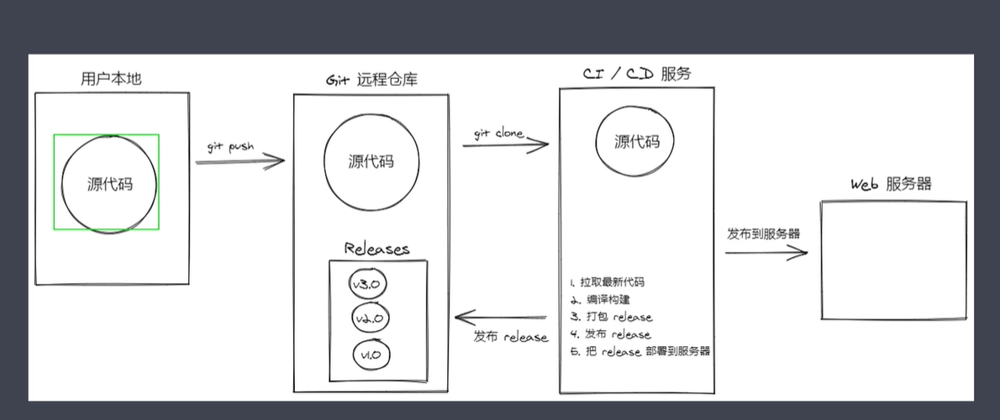

## vuex状态管理
#### 组件内的状态管理流程
vue最核心的两个功能： 数据驱动和组件化
#### 组件间通信方式
+ 父组件 --> 子组件
  - props
+ 子组件 --> 父组件
  - $emit
+ 不相关组件
  - eventBus  bus.$emit bus.$on
+ 其他方式
  - $root
  - $parent
  - $children
  - $refs【会导致数据管理的混乱】
    - 普通HTML标签上使用ref，获取的是DOM对象
    - 组件标签上使用ref，获取的是组件实例

#### 简易的状态管理方案
集中式状态管理全局store 
创建一个共享的store [store](./smallStore.js),
在组件中使用[使用store](./useStre.js)
#### vuex
+ state 
  - mapState 
    - ...mapState(['count', 'msg']),
    - computed: { ...mapState({ num: state => state.count, message: state => state.msg }) }
+ mapGetter
+ Mutation
  - mapMutations
+ action
  - mapAction
+ Module
#### Vuex插件
+ 是一个函数
+ 接收一个store的参数
```
const myPlugin = store =>{
  store.subscribe((mutation,state)=>{

  })
}

new Vuex.Store({
  ...
  plugins:[myPlugin]
})
```
#### 模拟实现vuex 
[代码实现](./vux/index.js)
+ 实现思路
  - 实现install方法
    - 先实现Vue插件约定的install方法
  - 实现Store类
    - 构造函数接收options
    - state的响应化处理
    - getter的实现
    - commit、dispatch方法

## 服务端渲染
+ SPA 缺点
  - 首屏渲染时间长
  - 不利于SEO
+ 同构应用
  - 通过服务端渲染首屏直出，解决SPA应用首屏渲染慢以及不利于SEC问题
  - 通过客户端渲染接管页面内容交互得到更好的用户体验
  - 这种方式称之为现代化的服务端渲染，也叫同构渲染
  - 这种方式构建的应用也称之为服务端渲染应用或同构应用
+ 渲染相关的概念
  - 什么是渲染
    - 把数据+模板拼接到一起
  - 传统的服务端渲染
    - 传统渲染演示
      - express搭建web服务器 使用模板引擎 渲染一个页面 [参考](./server/index.js)
    - 缺点
      - 前后端耦合，不利于开发维护
      - 前端没有足够的发挥空间
      - 服务端压力大
      - 用户体验一般
  - 客户端渲染
    - 首屏渲染慢
      - 多次的http请求
    - 不利于SEO
  - 现代化的服务端渲染（同构渲染）
    - 后端+前端
    - 首屏直出（首屏在服务端渲染）
    - 客户端渲染一次，用于接管页面交互
  - 同构渲染的实现
    - next.js(React)
    - nuxt.js(Vue)
  - 同构渲染问题
    - 开发条件受限
    - 扩展库可能需要特殊处理
    - 不能再服务端渲染期间不能操作DOM
    - 构建和部署 
      - 客户端渲染 仅构建客户端就行，同构需要构建两个端
      - 客户端渲染可以部署在任意服务器 同构一般部署在node环境
    - 服务端负载大
## NuxtJS
+ 介绍
  - [官网](https://zh.nuxtjs.org/) [github](https://github.com/nuxt/nuxt.js)
  - 一个基于vue的服务端渲染应用框架
  - 预设好了vue开发服务端渲染应用的配置
  - nuxt generate 为基于vue的应用提供生成对应的静态站点的功能
  - 为客户端/服务端提供了许多有用的特性，如异步数据加载、中间件支持、布局支持
+ 特性
  - 基于vue
  - 自动代码分层
  - 服务端渲染
  - 强大的路由功能，支持异步数据
  - 静态文件服务
  - ES6+ 语法支持
  - 打包和压缩JS和CSS
  - HTML头部标签管理
  - 本地开发支持热加载
  - 集成ESlint
  - 支持各种样式预处理器 SASS LESS Stylus
  - 支持HTTP/2推送
+ 使用webpack、vue-loader、babel-loader来处理代码的自动化构建工作（如打包、代码分层、压缩等）
+ 使用方式
  - 初始化项目
  - 已有的node服务端项目
    - 直接把nuxt当做一个中间件集成到node web server中
  - 现有的vue项目
    - 非常熟悉nuxt
    - 代码改动
+ 初始化项目
  - 使用create-nuxt-app脚手架
  - 手动创建
    - pages文件夹

+ nuxt 路由
  - 根据pages自动生成
  - nuxt-link
+ 路由导航
  - a标签
  - nuxt-link
  - 编程式导航

## nuxt案例
+ 初始化项目
+ 导入项目模板
  - 导入样式资源
  - 配置布局组件
  - 配置页面组件
+ nuxt不同之处
  - 状态持久化 js-cookie设置到cookie 服务端cookieparser 解析
  - nuxtServerInit 服务端渲染的action
    - 会在服务端渲染期间自动运行
    - 作用：初始化容器数据，传递数据给客户端使用
  - 路由权限控制使用中间件
    - 动态添加需要重新运行服务
  - 监听query参数变化
    - watchQuery
  - 插件
  - MarkDown转HTML  markdown-it

+ 打包部署
  - 打包
    - "dev": "nuxt",
    - "build": "nuxt build"
    - "start": "nuxt start"
    - "generate": "nuxt generate"
  - 部署
    - scp 上传压缩包
    - 解压 unzip
    - 安装依赖
    - pm2启动
      - pm2 start 脚本路径（pm2 start npm -- start）
      - pm2 stop 
      - pm2 list
      - pm2 reload
      - pm2 restart
      - pm2 delete
    - 自动化部署
      
    - 使用gitHubActions实现
      - 


      fb7737a541276bc3d2f67d13acbd7410df3b6d5f
      仓库-setting- Secrets-New secret

      配置执行脚本
      .github/workflows
        
+ 参考资料
  - [realworld](https://github.com/gothinkster/realworld)
  - [realworld在线示例](https://demo.realworld.io/#/)
  - [接口文档](https://github.com/gothinkster/realworld/tree/master/api)
  - [页面模板](https://github.com/gothinkster/realworld-starter-kit/blob/master/FRONTEND_INSTRUCTIONS.md)